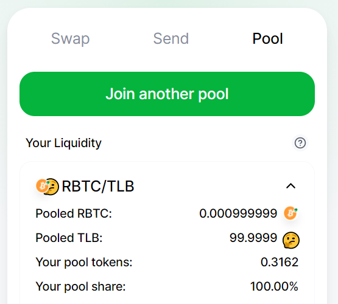

# RSKSwap using smart contracts


[RSKSwap](https://rskswap.com/) is a decentralized exchange to automatically exchange ERC20 tokens, there is no need to wait for a buyer or seller.

It has the advantage of the low costs and security of the RSK network.

It also doesn’t require KYC and has no limits for withdrawals or deposits.

In this post I will present a step-by-step guide to create your own token and exchange it in [RSKSwap](https://app.rskswap.com/) automatically, using smart contracts.

You can read the RSKSwap [Documentation](https://rskswap.com/docs/v2/) to learn more about it.


# Overview

Here is a summary of the steps we will take in this tutorial:

We will do these steps:

1. Configure Metamask to connect to RSK Testnet;
2. Get some Testnet R-BTCs at faucet;
3. Connect Remix with RSK Testnet;
4. Create a token
5. Configure to use RSKSwap - UniswapV2Router02
6. Add liquidity in a pool on RSKSwap
7. Query prices
8. Do the swap itself


# Requirements

- Metamask - google chrome extension
- Remix - Solidity IDE online

To learn more about Remix and Metamask, go to the tutorial [how to use Remix and Metamask to deploy smart contracts on the RSK Testnet](en/remix-metamask/readme.md).

## Metamask 

Go to [metamask.io](https://metamask.io/) and install it.

## Remix

To use Remix, visit  [remix.ethereum.org](https://remix.ethereum.org/)

## Connect MetaMask to RSK Testnet

- Click on the Metamask extension in your browser.
- Go to networks
- Select **Custom RPC**


Fill in the fields with the information below:

- Network Name

RSK Testnet

- New RPC URL

https://public-node.testnet.rsk.co

- ChainID (optional)

31

- Symbol (optional)

tRBTC

- Block Explorer URL (optional)

https://explorer.testnet.rsk.co


After configuring it, close the window and select the **RSK Testnet**.

# TestNet Faucet

You can get some Testnet RBTC at [faucet.testnet.rsk.co](https://faucet.testnet.rsk.co/) 

# Remix

Go to [remix.ethereum.org](http://remix.ethereum.org/)


## Solidity compiler

In the third button on the left side, click Solidity compiler

It is useful to enable automatic compilation (auto-compile), to compile smart contracts automatically when editing in Remix.


# Connect Remix to RSK Testnet

First of all, be sure that you selected the RSK network in Metamask.

Then, in Remix, on the left side, locate the fourth button - Deploy and run transactions..

In Environment, choose Injected Web3


Injected Web3 connects Remix with active accounts in Metamask

A Metamask popup window will open to authorize the connection.

First, select the account and click the Next button. You probably only have one, and in the other window, click the Connect button


In Remix, in Deploy and run transactions, look at the Custom Network.

ChainID 31 was defined at RSK Testnet custom network in Metamask.


# Create the token

Click on the second button on the left side - file explorer

Click on + create a new file

File name: TokenHelloDecentralization.sol

Copy and paste this token:

```solidity
// SPDX-License-Identifier: MIT
pragma solidity 0.8.0;

import "https://github.com/OpenZeppelin/openzeppelin-contracts/blob/master/contracts/token/ERC20/ERC20.sol";

contract TokenHelloDecentralization is ERC20 {
    constructor(uint256 initialSupply) public ERC20("Token Hello Decentralization 2021", "THD") {
        _mint(msg.sender, initialSupply);
    }
}
```


# Compile the token

If you have enabled auto-compile, the smart contract is already compiled and a green light will appear next to the third button from the left - Solidity compiler.

If you didn't enable it:

- Click the third button from the left: Solidity compiler
- Click the Compile TokenLaBitconf.sol button
- Check the green sign on the third button with the message: compilation successful

# Deploy the token

In the left side panel, go to the fourth button - Deploy and run transactions.


For now we have only one smart contract, so it is automatically selected in the dropdown.

We are going to create 1000 tokens, with 18 decimal places: 

1000000000000000000000

For easy conversions, I recommend you use: [eth-converter.com](https://eth-converter.com/)  

Click the Deploy button.


It will open a Metamask popup window, to confirm the transaction to create the smart contract TokenLaBitconf.sol

Click on confirm.

At bottom right, we can check the message: creation of TokenLaBitconf pending...

When the transaction was confirmed, copy the token address

For example, mine is:

```
0x2346dDF3D362472A80cF18Ab288594F3204Fb415
```


# RSKSwap - UniswapV2Router02

Now we are going to interact with RSKSwap's main smart contract, which is the `UniswapV2Router02`

RSK - UniswapV2Router02 Testnet / Mainnet address:

``` shell
0xf55c496bb1058690DB1401c4b9C19F3f44374961
```

## UniswapV2Router02 Interface

We must have an interface with the functions of UniswapV2Router02 to use in this tutorial.

In file explorer, create a new file.

File name: InterfaceRouter.sol

Copy and paste this example:

```solidity
// SPDX-License-Identifier: MIT
pragma solidity 0.6.12;

// Source: https://github.com/Think-and-Dev/rskswap-periphery/blob/master/contracts/UniswapV2Router02.sol;

abstract contract InterfaceRouter {
    
    function addLiquidityETH(
        address token,
        uint amountTokenDesired,
        uint amountTokenMin,
        uint amountETHMin,
        address to,
        uint deadline
    ) external payable virtual returns (uint amountToken, uint amountETH, uint liquidity);

    address public WETH;
        
    //Si quiero comprar tokens X, ¿cuándo tengo que enviar tokens Y?
    function getAmountsIn(uint amountOut, address[] calldata path) 
        external view virtual returns (uint[] memory amounts);

    function swapETHForExactTokens(uint amountOut, address[] calldata path, address to, uint deadline)
        external
        payable
        virtual
        returns (uint[] memory amounts);
}
```


In the right side of **At Address** button, paste the UniswapV2Router02 address:


Now I have two contracts in the **deployed contracts** section:


# RSKSwap App

Using the user interface of RSKSwap in [app.rskswap](https://app.rskswap.com/), we can do simulations and follow along.
Click on **Connect to a wallet**, choose the **Metamask** wallet, approve the connection on Metamask pop-up window, then go to **Pool**.


Do these steps:

* Click **Import it**
* Click **Select a token**
* Paste your token address
* Click on the Token line to select it


You will receive the message **No pool found**. 

Do NOT create the pool here because we will do it programmatically.


# Add Liquidity on RSKSwap

To add liquidity to Uniswap, you always need to match it with two pairs. 

Let’s create a liquidity pool to exchange our token with tRBTC.

You are the first liquidity provider. The ratio of tokens you add will set the price of this pool.

For example:
- 0.1 RBTC = 100 tokens
- 0.001 RBTC por token
- 1000 token por RBTC

We must do 2 steps to add liquidity:

1. Approve in the Token ERC20::approve(address _spender, uint256 _amount) 
2. Add liquidity using the function UniswapV2Router02::addLiquidityETH(...)

## Approve Router to Spent Token

In the token, we will approve RSKSwap in order to use 100 tokens.
- address _spender: 0xf55c496bb1058690DB1401c4b9C19F3f44374961
- uint256 _amount: 100000000000000000000

``` shell
"0xf55c496bb1058690DB1401c4b9C19F3f44374961","100000000000000000000"
```


Then click the Approve / Transact button

## Add Liquidity usando Remix

In the `InterfaceRouter`, interface, expand the `addLiquidityETH` button.

Complete with the following parameters: 

* token = token address
* amountTokenDesired = amount of tokens which we would like to add in the liquidity pool.
* amountTokenMin = amountTokenDesired because it is the first time, the liquidity pool is empty
* amountEthMin = we are creating this liquidity pool now defining the amount of RBTCs (Ethers), so we are defining the price of the token in RBTC (ETH)
* to = your address, because you would like to receive the fees later
* deadline = it is a Unix timestamp in the future, so view the current timestamp and add a few minutes.

I use the site [unixtimestamp](https://www.unixtimestamp.com/index.php) to know the current timestamp.

To add 5 minutes, use + 300 seconds.

Here is my example:

* token = 0x2346dDF3D362472A80cF18Ab288594F3204Fb415
* amountTokenDesired = 100 * 10 ^18 (100 y 18 zeros) = 100000000000000000000
* amountTokenMin = amountTokenDesired because it’s the first time we add liquidity
* amountEthMin = 0.001 * 10 ^18 = 1000000000000000
* to = 0x1b1E4115dFD9352c3E2f6EFB289554C5Ee0560CD
* deadline = 1610316260

These are the parameters in addLiquidityETH function:

``` shell
"0x2346dDF3D362472A80cF18Ab288594F3204Fb415","100000000000000000000","100000000000000000000","1000000000000000","0x1b1E4115dFD9352c3E2f6EFB289554C5Ee0560CD","1610316260"
```


**BEFORE** you press the transact button, fill in the amount of RBTCs (ETHs) to send at the top of the form. We will send 0.001 RBTC (Ether)


Click the button **Transact** or **addLiquidityETH** and confirm the transaction on Metamask.


## Check the RSKSwap app

In the RSKSwap app, go to **Pool** , you should probably find your pool now!



# WRBTC / WETH ERC20 Address

The address of the WETH ERC20 token can change from one network to another, but it is saved in a public variable of UniswapV2Router02 contract and we can query it in the interface.


So the WRBTC = WETH is 0x09B6Ca5E4496238a1F176aEA6bB607db96C2286E.

# Get prices

Let's get quotes and prices in RSKSwap programmatically.

If I would like to buy tokens, how many WETH (wRBTC) do I need to send?

To know this I will use the **getAmountsIn **function, with the parameters:

- amountOut = The amount I would like to receive
- path = the path is an array of addresses used to exchange, in this case: [wethAddress, tokenAddress]

This will calculate the amount you need to provide, so you will provide some RBTCs / ETHs (or wRBTC / wETH, which are automatically converted), since you want to receive an amount of tokens.

Now we would like to have 1 token (1 * 10 ^ 18). What is the price?

- amountOut = Receive 1 token = 1 * 10 ^ 18 = 1000000000000000000
- path =  ["0x09B6Ca5E4496238a1F176aEA6bB607db96C2286E", "0x2346dDF3D362472A80cF18Ab288594F3204Fb415"] 

Call **getAmountsIn** function using the parameters


```shell
"1000000000000000000",["0x09B6Ca5E4496238a1F176aEA6bB607db96C2286E", "0x2346dDF3D362472A80cF18Ab288594F3204Fb415"]
```

For our example, the result is 

`amounts 10131404313952,1000000000000000000`

Which means that:

* 10131404313952 wei RBTC (ETH) = 1000000000000000000 wei Token
* 0.0010131404313952 RBTC (ETH) = 1 Token


I would like to buy 1 Token, I must send 0.0010131404313952 RBTC (ETH).

Why aren't you sending exactly 0.001 RBTC (ETH)?

* It has a small fee of 0.30%.
* Also the effect of this trade will influence reserves and, therefore, it is necessary to adjust the formula of the constant product, so that the product must remain constant. This will give a different price to the price given to foreign exchange reserves.

# Execute the swap

The last step is to execute an exchange. That's pretty easy now that you understand how the Router works.

When you buy tokens with RBTC (ETH), which are probably one of the most common scenarios, you will call the **swapETHForExactTokens** function, with parameters:

* amountOut = amount of tokens, including the decimals places, so 1 token is 1 * 10 ^ 18
* path = is the array ["addressWei", "addressToken"]
* to = it is your address
* deadline = the Unix timestamp in the future, so get the current timestamp and add a few minutes.

For example, I want to buy 1 Token:

* 0.0010131404313952 RBTC (ETH) = 1 Token
* amountOut = 1000000000000000000
* path = ["0x09B6Ca5E4496238a1F176aEA6bB607db96C2286E", "0x2346dDF3D362472A80cF18Ab288594F3204Fb415"]
* to = 0x54bE4C3721d2dE76eE0104e53b52Ca8B3A1E27Ca
* deadline = 1607694938

These are the parameters to use in the function **swapETHForExactTokens** :

```shell
"1000000000000000000",["0x09B6Ca5E4496238a1F176aEA6bB607db96C2286E","0x2346dDF3D362472A80cF18Ab288594F3204Fb415"],"0x54bE4C3721d2dE76eE0104e53b52Ca8B3A1E27Ca","1610317574"
```


**BEFORE** pressing the transact button, fill in the amount of RBTCs (ETHs) to send at the top of the form. We will send 10131404313952 WEI


Click the button **Transact** or **swapETHForExactTokens** .

## Check the RSKSwap app

In the RSKSwap app, go to the Pool and confirm that you have one less token!


# Final considerations

In this tutorial, I have shown you how to create a token and exchange it programmatically, using RSKSwap smart contracts.

I hope this tutorial has been helpful and I appreciate your comments. Share it if you like it :)

