# Plant box - a complete dApp built with Truffle box template rsk-plant-box

In this tutorial, I will show you step-by-step how to use the Truffle box [rsk-plant-box](https://github.com/rsksmart/rsk-plant-box), 
which comes with everything you need to create a complete dApp - decentralized application on RSK networks. 
It includes network configurations for Mainnet, Testnet, local node (regtest) and also an user interface to interact with the smart contract.

> It was inspired by [Truffle pet shop box](https://www.trufflesuite.com/boxes/pet-shop). 
> Thanks, Truffle team :)

# Overview

Here is a summary of the steps we will take in this tutorial:

1. [Setup prerequisites](#setup-prerequisites);
2. [Install RSK Truffle Plant Box](#install-rsk-truffle-plant-box);
3. [Understand the smart contract](#plantshopsol)
4. [Learn how to use the Truffle development console](#truffle-development-console);
5. [Compile plantshop.sol](#compile-a-smart-contract);
6. [Deploy the smart contract](#deploy-a-smart-contract);
7. [Run tests](#test-a-smart-contract);
8. [Interact with a smart contract in development console](#interact-with-a-smart-contract-in-development-console);
9. [Learn how to use the RSK networks](#using-rsk-networks);
10. [Work on RSK testnet](#rsk-testnet);
11. [Connect to an RSK network](#connect-to-an-rsk-network);
12. [Test the connection to RSK network](#test-the-connection-to-rsk-network);
13. [Deploy a smart contract on RSK network using Truffle](#deploy-the-smart-contract-on-rsk-network);
14. [Interact with the deployed contract on RSK network](#interact-with-the-deployed-contract-on-rsk-network);
15. [Run the dApp](#the-dapp).

If you were redirected from the Truffle [rsk-plant-box](https://github.com/rsksmart/rsk-plant-box) page, this tutorial helps you to review the steps with more explanatory details and images. 

This tutorial has some exclusive sections which aren't in the box's instructions:

- [Interact with a smart contract in development console](#interact-with-a-smart-contract-in-development-console)
- [Interact with the deployed contract on RSK network](#interact-with-the-deployed-contract-on-rsk-network)

# Setup prerequisites

There are a few technical requirements before we start. 
If you don't have any of them installed, go to the tutorial
[Truffle project prerequisites](./en/truffle/truffle-project-prerequisites.md) 
which have all the instructions to setup these requirements.

To use `Truffle boxes`, you need to have installed in your computer:

1. [Git](./en/truffle/truffle-project-prerequisites?id=git)
2. [POSIX compliant shell](./en/truffle/truffle-project-prerequisites?id=posix-compliant-shell)
3. [cURL](./en/truffle/truffle-project-prerequisites?id=curl)
4. [Node.js and NPM](./en/truffle/truffle-project-prerequisites?id=nodejs-and-npm)
5. [Code editor](./en/truffle/truffle-project-prerequisites?id=code-editor)
6. [Truffle framework](./en/truffle/truffle-project-prerequisites?id=truffle-framework)

# Install RSK Truffle Plant Box

The `truffle unbox` command sets up a project based on a known template. 
In this tutorial, we will be using the “RSK plant box” Truffle box, 
which comes with everything you need to build a complete dApp on RSK networks, including a frontend. 

## Create a new folder 

For example, create the folder `rsk-plant`.
Navigate to the folder in the terminal.

```shell
mkdir rsk-plant
cd rsk-plant
```

## Run the unbox command

The truffle unbox command will install all necessary dependencies in the project.

```shell
truffle unbox rsksmart/rsk-plant-box
```
This is the result using Windows OS:

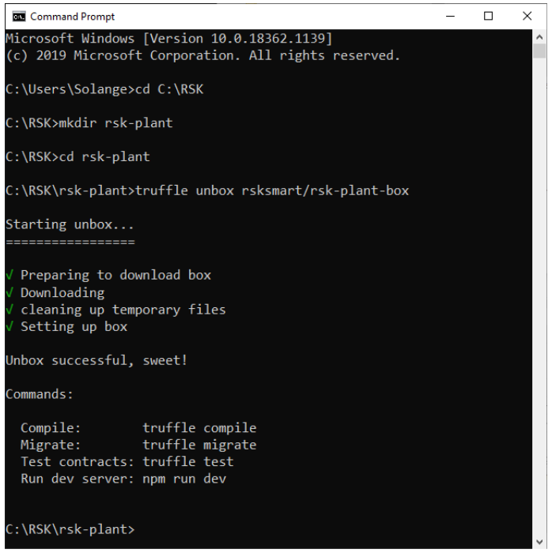

# PlantShop.sol

Take a look at the smart contract `PlantShop.sol`. You can check it out in folder `contracts`.

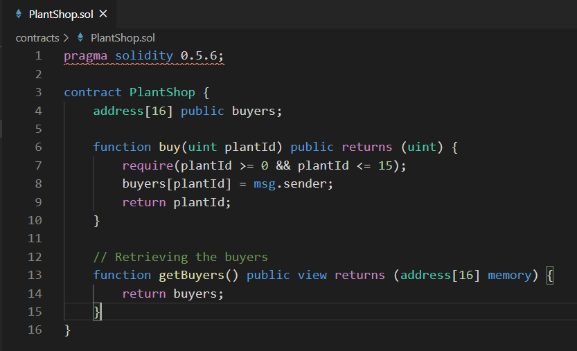

This smart contract has:

* A variable `buyers` to store an array with 16 positions to store addresses
* A function `getBuyers` to return the list of addresses stored at variable `buyers`
* A function `buy` to update an address at variable `buyers`, in the number of position sent as parameter

# Truffle development console

Truffle has an interactive console that also spawns a development blockchain. 
This is very useful for compiling, deploying and testing locally.

Run the development console by typing the following command below into the terminal:

```shell
truffle develop
```

This command is successful if you see a list of 10 accounts, a mnemonic and the command prompt is now `truffle(develop)>`

```txt
C:\RSK\rsk-plant>truffle develop
Truffle Develop started at http://127.0.0.1:8545/

Accounts:
(0) 0x1056f747cf4bc7710e178b2aeed4eb8c8506c728
(1) 0x45a71c00382c2898b5d6fae69a6f7bfe6edab80c
(2) 0x1596384706dc9ac4cca7f50279a4abe591d6c3fe
(3) 0x9576d0a496b645baa64f22aceb2328e7468d4113
(4) 0xd431572eef7d77584d944c1809398a155e89f830
(5) 0x92c111839718fe0800fadccc67068b40b8524a0f
(6) 0x6da22b5a027146619bfe6704957f7f36ff029c48
(7) 0x2c3a82d8c3993f8c80dcaf91025437bd057df867
(8) 0xc43ae7a44f7deb759177b7093f06512a0a9ff5d7
(9) 0xe61bf00cd7dce248449cfe58f23a4ef7d542bc0b

Private Keys:
(0) f32f32839fe27ad906b63eafb326f26fed95c231e3c5e33c7cdd08f62db63167
(1) ebef990088f27f6ef13b5e52a77d5dcc5a76862a701908c586d01b6fe93562b3
(2) 598ccae5e4436fedeb0e798c0d254789c55a63401ebfc3ae8ddde29634ddfcde
(3) 09934b80f391e0024b8cb00cd73790fdf64c4d0509e144766414fee317cd3f4e
(4) ac745b84b6574b5738d364b43e0d471c9d5107504acc709c90f6f091b78c751b
(5) 449654cde095f2349113ef12a93e139b4302bc95adb3619d08adf53dde9b8847
(6) c217f12a89c352fc70b5f1bd5742314b4fb1bb1e35cb779fdb3c2390106355db
(7) 1d4c74dfa4e99e161130c18cc63938bb120a128cefbf1b9188efc678bf5722cb
(8) 0f44e0becf2e090db498a1b747d2a758fcc81fb0241f350d61117a9c6b1fa82e
(9) 85218c5eec657470dafeb09e6f7101f91d21bfe822fbeeecfc9275f798662a63

Mnemonic: virtual valve razor retreat either turn possible student grief engage attract fiber

⚠️  Important ⚠️  : This mnemonic was created for you by Truffle. It is not secure.
Ensure you do not use it on production blockchains, or else you risk losing funds.

truffle(develop)>  
```

You are now in the truffle develop console with seeded accounts and their associated private keys listed.

> Inside the development console we don't preface commands with `truffle`.

# Compile a smart contract

In the Truffle console, run this command:

```javascript
compile
```

The `compile output` should be similar to:

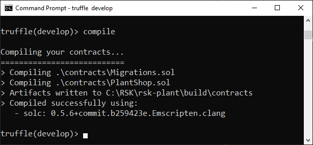

# Deploy a smart contract

To deploy a smart contract using Truffle, we need a new migrations file where Truffle will find it. 
This file contains instructions to deploy the smart contract. 

The `migrations` folder has JavaScript files that help you deploy contracts to the network. 
These files are responsible for staging your deployment tasks, and they're written under the assumption that your deployment needs will change over time. 
A history of previously run migrations is recorded on-chain through a special Migrations contract. 
(source: [truffle: running-migrations](https://www.trufflesuite.com/docs/truffle/getting-started/running-migrations))

Take a look in the file `2_deploy_contracts.js` located in the migrations folder. 

## Migrate

In the Truffle console, run this command:

```javascript
migrate
```

And the `migrate output` should be similar to:

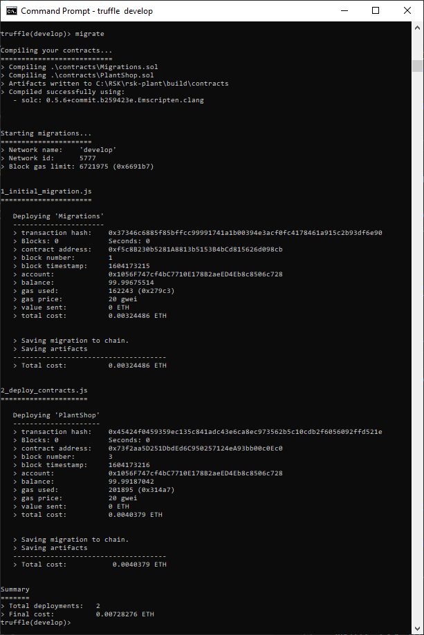

# Test a smart contract

Truffle has an automated testing framework to facilitate the testing of contracts.
All test files should be located in the `test` directory.
To learn more, go to the Truffle documentation, in the section [testing your contracts](https://www.trufflesuite.com/docs/truffle/testing/testing-your-contracts).

This Truffle box comes with the file `TestPlantShop.js` for testing the smart contract. 
You can check it out in the `test` folder.

Run this command in the development console:

```javascript
test
```

The `test output` should be similar to:

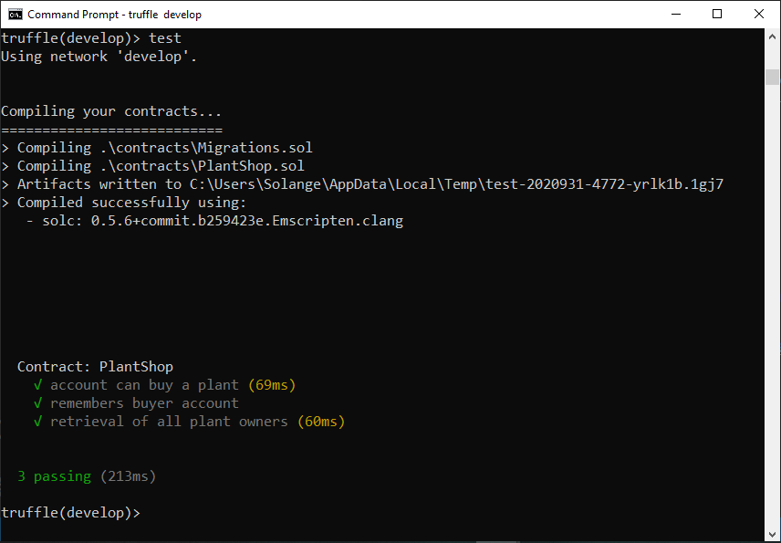

Note the command varies slightly if you're in or outside of the development console.

```javascript
// inside the development console.
test

// outside the development console.
truffle test
```

# Interact with a smart contract in development console

> Make sure you had deployed the smart contract before executing this part.

The next commands will run inside the development console:

```shell
truffle develop
```

## Get your accounts 

Truffle develop console comes with a list of 10 unlocked accounts. We will store them in a variable called `accounts`:

```javascript
const accounts = await web3.eth.getAccounts()
```

Don’t worry about the `undefined` return, it is ok. See the addresses after it by entering the command below:

```javascript
accounts
```

And to view each account:

```javascript
accounts[0]
accounts[1]
```

Take a look in the results:

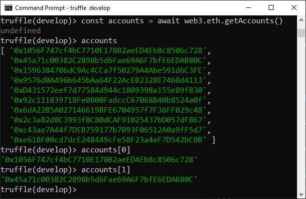


## Connect with our published contract

In the Truffle console, run this command to connect with the deployed smart contract:

```javascript
const garden = await PlantShop.deployed()
```

Now `garden` variable contains an instance of `PlantShop`, the previously deployed contract.

> Don't worry about the `undefined` return, it is ok. 

## About PlantShop.json

To interact with a published smart contract, you must have 2 informations:
1. ABI - Application Binary Interface
2. Contract address

The published contract information which is called contracts artifacts, 
is stored by default in the `build\contracts` folder. 
Over there you will find a JSON file with the same name of our smart contract.

### ABI - Application Binary Interface

The [ABI](https://solidity.readthedocs.io/en/v0.5.3/abi-spec.html) is the standard way to interact with contracts, both from outside the blockchain and for contract-to-contract interaction. 

You can found it in the the section `ABI` of the json file:

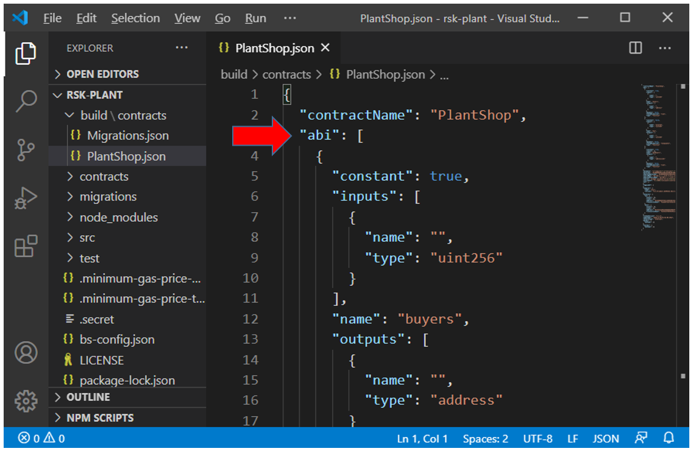

### Deployed addresses

The section `networks` contains the networks in which the smart contract was published, including its address and hash of the transaction.

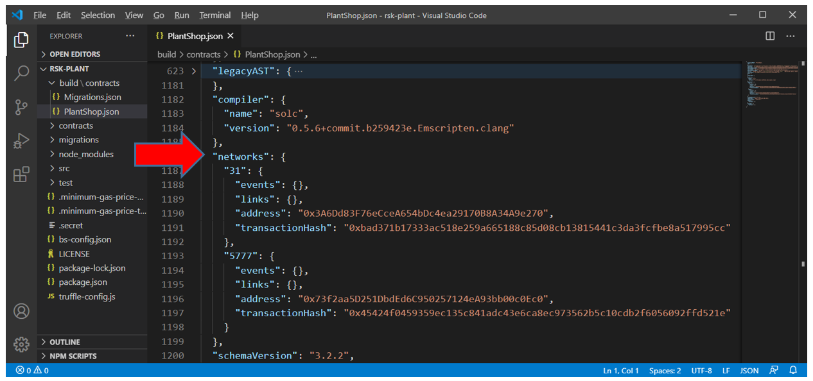

## Confirm if garden, the plantShop instance, is OK.

Enter the instance's name:  `garden`, then type `.` (dot), and, without space, hit the TAB key twice to trigger auto-complete as seen below. 
This will display the published address of the smart contract, the transaction hash for its deployment, among other things, including all public variables and methods available.

```javascript
garden. [TAB] [TAB]
```

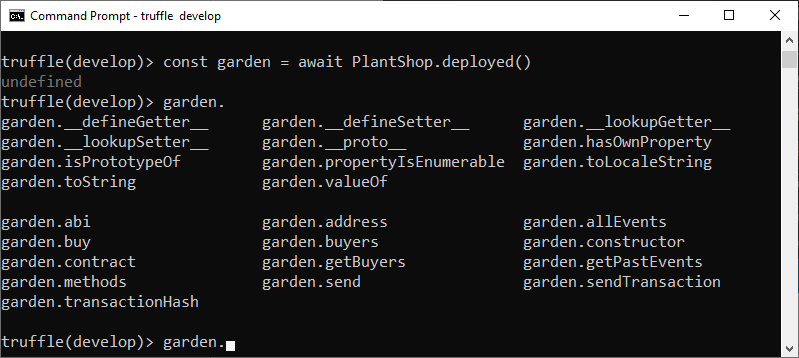

## Check the plant's buyer address 

We know that the variable `buyers` stores an array with 16 posisions of addresses, one for each plant's owner or buyer. 

For example, I would like to know who got the plant located in the index 2:

```javascript
garden.buyers(2)
```

The returned address is `0x0000000000000000000000000000000000000000`, which is expected, since nobody got a plant yet.


## Buy a plant

In our garden store, don't worry about the prices, the plants are free!

To buy a plant, use the function `buy`. For example, I would like to buy the plant located in the index 2: 

```javascript
garden.buy(2)
```

It will return a transaction:

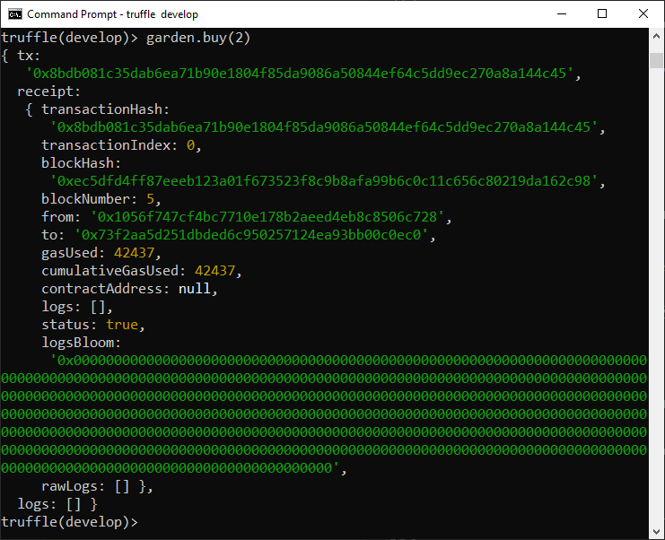


## Check the plant's buyer address (again) 

Read the buyers array at index 2 again:

```javascript
garden.buyers(2)
```

The returned address changed and now is the first account defined in Truffle develop console:


## Buy another plant

Try to buy another plant, for example, at index 5:

```javascript
garden.buy(5)
```

## Buy a plant from a different account

In the previous steps, we buy plants no worring about which account was used to buy it.

But remember that the Truffle develop console has 10 unlocked accounts, which was previously stored in the `accounts` variable. 

Try to buy the plant 1 using account 1:

```javascript
garden.buy(1, {from: accounts[1]})
```

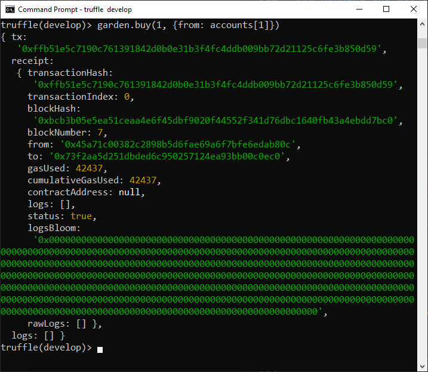

Also buy the plant 3 using account 4:

```javascript
garden.buy(3, {from: accounts[4]})
```

## List all plant's owners

The function `getBuyers` returns the array of buyers, 
which is the list of addresses who bought plants and are stored at variable `buyers`.

```javascript
garden.getBuyers()
```

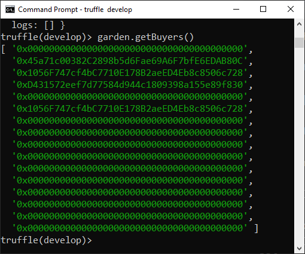

You may notice that some positions are filled with the addresses that purchased plants, 
while others continue with the zero address, which means that plants are still available.

# Using RSK networks

Truffle makes developing on RSK easier because we can configure custom networks for RSK.
This Truffle box is already configured to connect to three RSK networks:

1. regtest (local node)
2. testnet
3. mainnet

These networks are already configured in the `truffle-config.js` file.

Testnet will be used in this tutorial. For other networks:

**RSK regtest (Local node)**

To use the Truffle box connected to a local node, go to the tutorial [how to use Truffle connected to a local node](./en/truffle/truffle-regtest.md)

**RSK mainnet**

Follow the same instructions, just replacing `testnet` to `mainnet`. 
Some differences will be explained too.

# RSK testnet

We need to do some tasks:

- Setup an account / create a wallet
- Update .secret
- Connect to an RSK network
- Get tRBTC
- Setup RSK network gas price
- Deploy in the network of your choose

## Create a wallet

The easy way to setup an account is using a web3 wallet injected in the browser.

I present tutorials for some options:
- [Metamask](./en/wallets/wallet-metamask.md)
- [Nifty](./en/wallets/wallet-nifty.md)

Select the RSK Network in the web wallet.


Take a look `truffle-config.js` file to realize that we are using `HDWalletProvider` with RSK Networks derivations path:
- RSK Testnet dpath: `m/44’/37310’/0’/0`
- RSK Mainnet dpath: `m/44’/137’/0’/0`

For more information, check [RSKIP57](https://github.com/rsksmart/RSKIPs/blob/master/IPs/RSKIP57.md).

## Update .secret file

After creating your wallet, copy your mnemonic.

Paste the wallet mnemonic in the file `.secret`, located in the folder project, and save it.


# Connect to an RSK network

Run the development console for any RSK network.

<!-- tabs:start -->
#### ** RSK Testnet **

```shell
truffle console --network testnet
```

#### ** RSK Mainnet **

```shell
truffle console --network mainnet
```
<!-- tabs:end -->

This action instructs Truffle to connect to an RSK public node and grants it permission to control the accounts created with your mnemonic through the `HD wallet provider`.

Let's connect to the Testnet network:

```shell
C:\RSK\rsk-plant>truffle console --network testnet
truffle(testnet)>  
```

# Test the connection to RSK network

On any of the networks, run this commands in the Truffle console:

## Block number

Shows the last block number.

```javascript
(await web3.eth.getBlockNumber()).toString()
```

## Network ID

To get the network ID, run this command:

```javascript
(await web3.eth.net.getId()).toString()
```

> [!NOTE]
> List of network IDs:
> - mainnet: 30
> - testnet: 31
> - regtest (local node): 33

Check it out the last steps in this image:

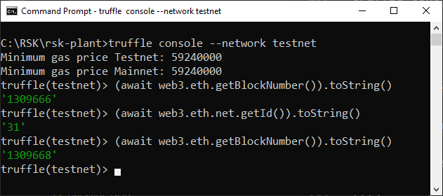

You can verify that I got the last block twice, and the block number increased, so we conclude that the connection is ok.

## Get your accounts 

```javascript
const accounts = await web3.eth.getAccounts()
```

> [!NOTE]
> Don't worry about the `undefined` return, it is ok. 

See the addresses after it by entering the command below:

```javascript
accounts
```

And to view each account:

```javascript
accounts[0]
accounts[1]
```

Copy the first account address, `accounts[0]`, to get some tR-BTCs later.

> [!ATTENTION]
> TODO - Image, check which is the accounts[0]

## Check balance

To check the balance of account[0], for example, run this command in Truffle console:

```javascript
(await web3.eth.getBalance(accounts[0])).toString()
```

If the balance is 0, your need to get some tRBTC to pay gas fees,
which will be used to publish smart contracts and interact with them.
We shall obtain some tRBTC in the next step.


## Get RBTC

The Smart Bitcoin (RBTC) is used to pay for the execution of transactions in RSK.

<!-- tabs:start -->
#### ** RSK Testnet **

Get tRBTC from [faucet](https://faucet.testnet.rsk.co/).

You can get more explanations on how to do it in 
[RSK faucet](./en/wallets/wallet-rsk-faucet.md) page.

#### ** RSK Mainnet **

For the RSK Mainnet, get RBTC from [an exchange](https://www.rsk.co/#exchanges-rsk).

<!-- tabs:end -->


## Recheck balance

To check balance again, run this command in the Truffle console:

```javascript
(await web3.eth.getBalance(accounts[0])).toString()
```

Great! Now I have 50000000000000000, which means that I have 0.05 tRBTC with 18 decimal place of precision.

## Exit Truffle console

In the Truffle console, enter this command to exit the terminal:

```shell
.exit
```

## Setup the gas price

To update the **minimumGasPrice** in our project follow the tutorial 
[setup the gas price to use with Truffle](./en/truffle/truffle-rsk-gas-price.md). 

# Deploy the smart contract on RSK network

Let's now switch to interacting with a "real" blockchain,
which is running on multiple nodes distributed around the world, across multiple computers!

We will do it running the below commands directly in the terminal, 
without using the Truffle console, to show you this alternative.

To use Testnet or Mainnet, you need to specify this using the parameter `-- network`. 
On any of the networks, run this command in a terminal (not in Truffle console).

<!-- tabs:start -->
#### ** RSK Testnet **

```shell
truffle migrate --network testnet
```

#### ** RSK Mainnet **

```shell
truffle migrate --network mainnet
```

<!-- tabs:end -->

I will do it on testnet.

The migrate process in a real blockchain takes more time, because Truffle creates some transactions which need to be mined on the blockchain.

Wait a few minutes… 

:tada: Congratulations! :tada:

The plant shop is now published on the RSK network.

> [!ATTENTION]
> Make sure you have enough tRBTC to deploy it.

## View the deployed contract in the Testnet explorer

You can copy the contract address and view it in the [Testnet explorer](https://explorer.testnet.rsk.co/).

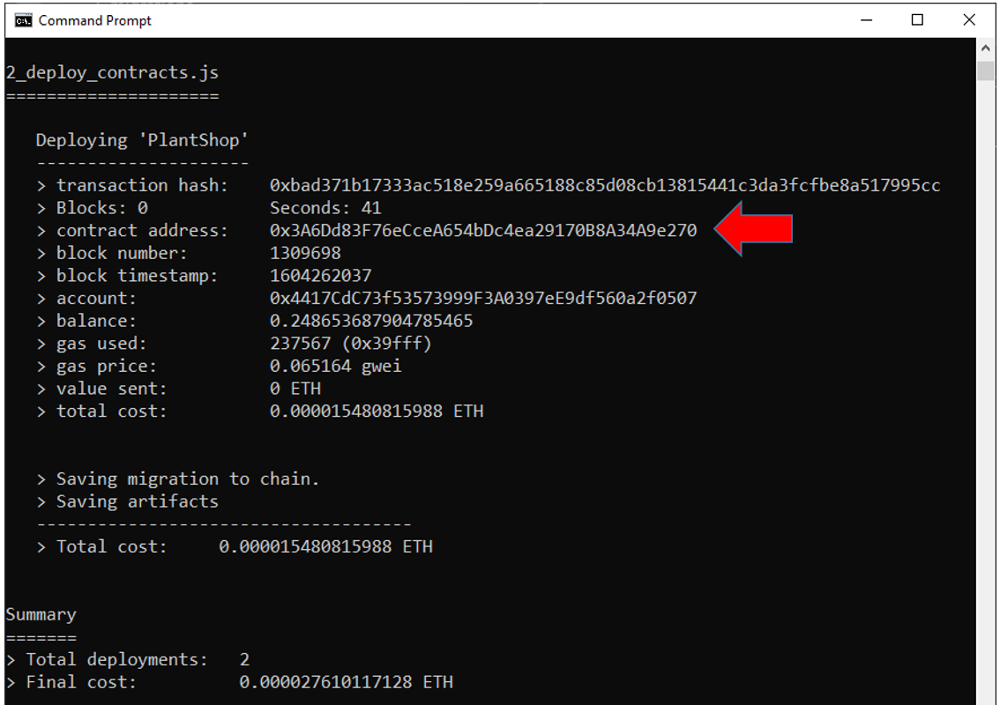

For example, [0x3A6Dd83F76eCceA654bDc4ea29170B8A34A9e270](https://explorer.testnet.rsk.co/address/0x3a6dd83f76eccea654bdc4ea29170b8a34a9e270) is the contract address for my last deploy.

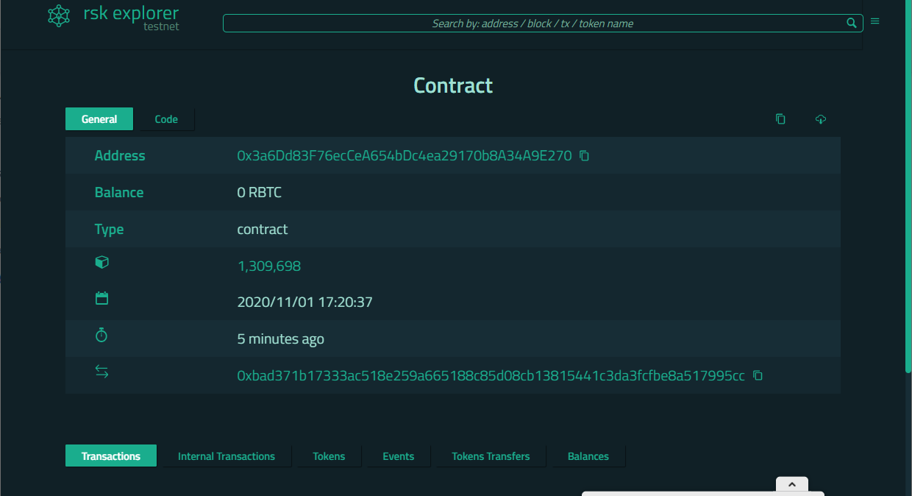

If you would like to have the code source verified, you can do it in the tab `Code` in the explorer.

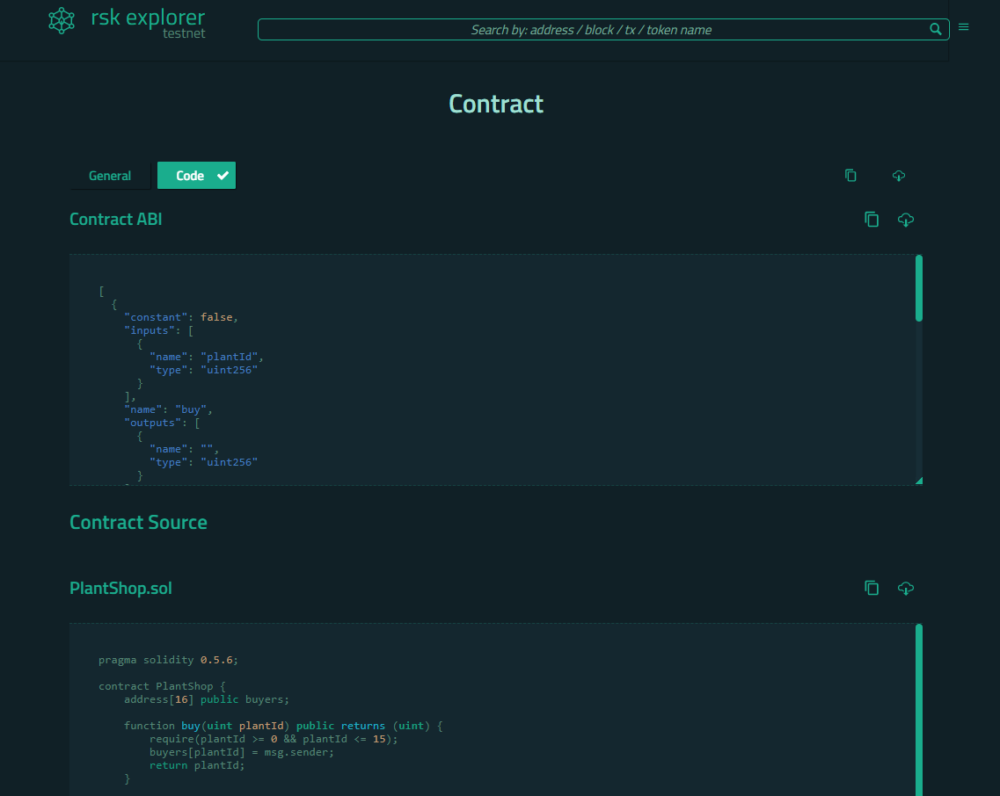

# Interact with the deployed contract on RSK network

> [!ATTENTION]
> Make sure you had deployed the smart contract before executing this part.

Do the same steps which was done before:

- Open Truffle console connected to the network which you deploy the smart contract
- Get your accounts
- Connect with the plant shop
- Check the plant's buyer address
- Buy a plant
- Check the plant's buyer address (again)
- Buy a plant from a different account
- List all plant's owners

## Truffle console on testnet

> [!NOTE]
> The next commands will run inside the Truffle console,
> connected to the network of your choice. 

In my case, it is testnet:

```shell
truffle console --network testnet
```

## Get your accounts 

```javascript
const accounts = await web3.eth.getAccounts()
```

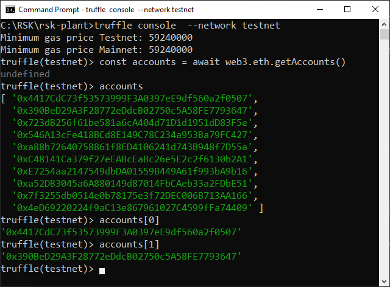

## Connect with the deployed contract

```javascript
const garden = await PlantShop.deployed()
```

## Confirm if the instance is OK.

```javascript
garden. [TAB] [TAB]
```

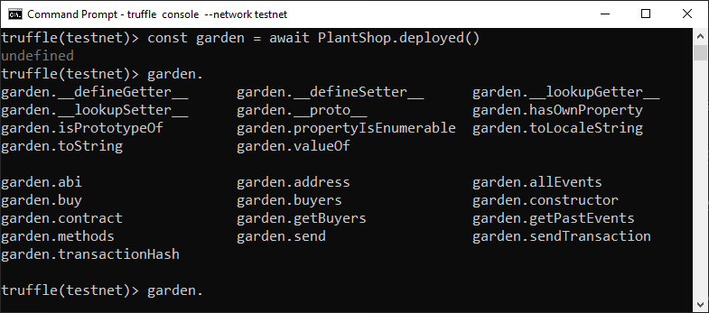

## Check the plant's buyer address 

For example, I would like to know who got the plant located in the index 3:

```javascript
garden.buyers(3)
```

## Buy a plant

In our garden store, don't worry about the prices, the plants are free!

To buy a plant, use the function `buy`. 
For example, I would like to buy the plant located in the index 3. 
I will store the transaction in a variable named `transaction`: 

```javascript
transaction = garden.buy(3)
```

> A transaction expects, on average, 30s to be mined on RSK networks.

## Check the plant's buyer address (again) 

Read the buyers array at index 3 again:

```javascript
garden.buyers(3)
```

This action instructs Truffle to connect to an RSK public node and grants it permission to control the accounts created with your mnemonic through the `HD wallet provider`.

The returned address changed and now is the default account from the wallet mnemonic, connected using the `HD wallet provider`:

Take a look in the last actions:

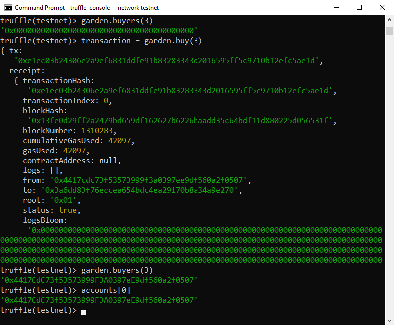

## Buy another plant

Try to buy another plant of your choice. I will buy the plant in index 2:

```javascript
garden.buy(2)
```

## Buy a plant from a different account

In order to buy a plant from a different account, you need to have tRBTC in the other account.

For example, I will use the `accounts[2]`.

Get the address of `accounts[2]`:

```javascript
accounts[2]
```

My `accounts[2]` address is `0x723dB256f61be581a6cA404d71D1d1951dD83F5e`.

Go to the [faucet](https://faucet.testnet.rsk.co/) to get tR-BTCs for the `accounts[2]`.

Check the `accounts[2]` balance:

```javascript
(await web3.eth.getBalance(accounts[2])).toString()
```

Try to buy the plant 0 using account 2:

```javascript
transaction = garden.buy(0, {from: accounts[2]})
```

Read the buyers array at index 0 and confirm that it is `accounts[2]`:

```javascript
garden.buyers(0)
```

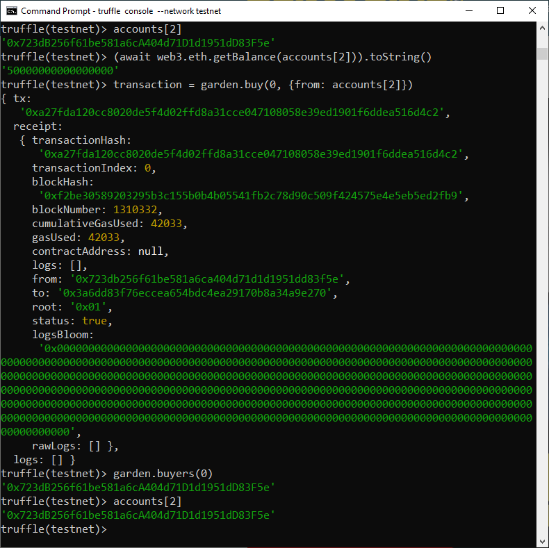

## List all plant's owners

Execute the function `getBuyers` to return the array of buyers.

```javascript
garden.getBuyers()
```

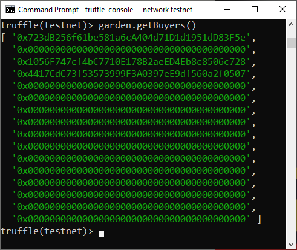

## Exit Truffle console

In the Truffle console, enter this command to exit the terminal:

```shell
.exit
```

# The dApp

Included with the plant-shop Truffle Box was the code for the app's front-end. That code exists within the `src` directory.

The front-end doesn't use a build system (webpack, grunt, etc.) to be as easy as possible to get started. 
The structure of the app is already there, including the functions to interact with the smart contract on Blockchain
This way, you can take this knowledge and apply it to your own front-end development.

## Select the network

To interact with the dapp in a browser, the easy way is using a web3 wallet injected in the browser.  

Select the same network which you ran the migrate command: 
- Nifty: select in the dropdown list
- Metamask: configure [RSK Testnet](./en/wallets/wallet-metamask.md)

## The lite-server

We're using the [lite-server](https://www.npmjs.com/package/lite-server) package to serve our static files. 
This shipped with the plant-shop Truffle Box, but let's take a look at how it works.

## Running the dev server

Now we're ready to use our dapp!

Outside the Truffle console, in a terminal, run the liteserver development server for front-end hot reloading. 
Smart contract changes must be manually recompiled and migrated.

Start the local web server:

```shell
npm run dev
```

The dev server will launch and automatically open a new browser tab containing your dapp.
It is running at [http://localhost:3000](http://localhost:3000)

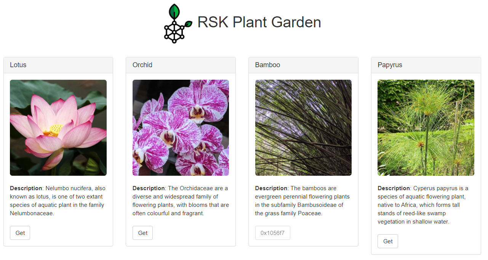

If you are using `Metamask`, a pop-up window should appear requesting your approval to allow Plant Shop to connect to your MetaMask wallet. 
Without explicit approval, you will be unable to interact with the dapp. 
Choose the account, click `next` and `connect`.


> If you change the network after the page appear on the screen, reload the browser to ensure the green button showing connected is active.

You can realize that some plants show the first characters of an account, which I bought them before, using the Truffle console.

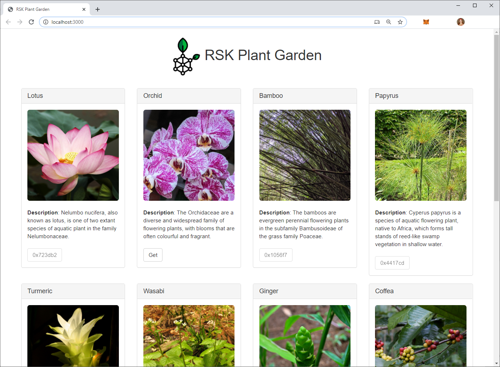

## Buying plants

In our garden store, don't worry about the prices, the plants are free!

To use the dapp, click the `Get` button on the plant of your choice.

You'll be automatically prompted to approve the transaction by the web wallet. 
Click Submit / Confirm to approve the transaction.

I will buy the coffee plant:

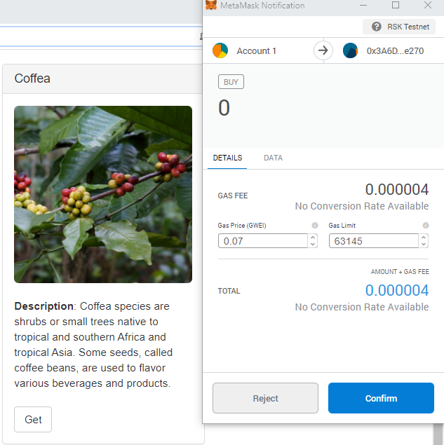

After the transaction is confirmed, you'll see the button next to the chosen plant change to show the first characters of the wallet that got the plant and become disabled, just as we specified, because the plant has now been acquired.

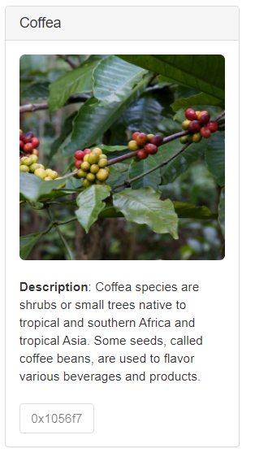

> If the button doesn't automatically change to show the account, refreshing the app in the browser should trigger it.

# Final considerations

Congratulations👏👏👏! You built and ran a complete dApp on RSK network!

In this tutorial you learned how to use the Truffle box [rsk-plant-box](https://github.com/rsksmart/rsk-plant-box)
to create a complete dApp on RSK blockchain.

I hope this tutorial has been helpful and I'd appreciate your feedback. 
Share it if you like it :)

**Do you have questions?**

Ask in [RSK chat](https://gitter.im/rsksmart/getting-started)
