# Using Truffle box rsk-starter-box

In this tutorial, I will show you step-by-step how to use the Truffle box [rsk-starter-box](https://github.com/rsksmart/rsk-starter-box), 
which comes with everything you need to start using Truffle on RSK networks. 
It includes network configurations for Mainnet, Testnet and the SimpleStorage contract as an example to deploy.

# Overview

Here is a summary of the steps we will take in this tutorial:

1. [Setup prerequisites](#setup-prerequisites);
2. [Install RSK Truffle Starter Box](#install-rsk-truffle-starter-box);
3. [Understand the smart contract](#simplestoragesol);
4. [Use the Truffle development console](#truffle-development-console);
5. [Compile a smart contract](#compile-a-smart-contract);
6. [Deploy a smart contract](#deploy-a-smart-contract);
7. [Test a smart contract](#test-a-smart-contract);
8. [Interact with a smart contract in development console](#interact-with-a-smart-contract-in-development-console);
9. [Using RSK networks](#using-rsk-networks);
10. [Connect to an RSK network](#connect-to-an-rsk-network);
11. [Test the connection to RSK network](#test-the-connection-to-rsk-network);
12. [Deploy a smart contract on RSK network using Truffle](#deploy-the-smart-contract-on-rsk-network);
13. [Interact with the deployed contract on RSK network](#interact-with-the-deployed-contract-on-rsk-network);

If you were redirected from the [Truffle-rsk-starter-box](https://github.com/rsksmart/rsk-starter-box) page 
and successfully executed all the instructions, you can go ahead and interact with the published smart contract:
- [In the Truffle development console](#interact-with-a-smart-contract-in-development-console).
- [On RSK network](#using-truffle-console-to-connect-to-the-rsk-network).

On the other hand, if you would like to review the steps with more explanatory details and images, you would find this tutorial helpful.

# Setup prerequisites

The requirements are explained in detail in this tutorial:
[Truffle project prerequisites](./en/truffle/truffle-project-prerequisites.md) 

# Install RSK Truffle Starter Box

The truffle unbox command sets up a project based on a known template. 
In this tutorial, we will be using the `RSK starter box` Truffle box, 
which includes RSK network configurations and the SimpleStorage contract as an example to deploy. 

## Create a new folder 
For example, create the folder `rsk-starter`.
Navigate to the folder in the terminal.

```shell
mkdir rsk-starter
cd rsk-starter
```

## Run the unbox command

The truffle unbox command will install all necessary dependencies in the project.

```shell
truffle unbox rsksmart/rsk-starter-box
```

This is the result using Windows OS:

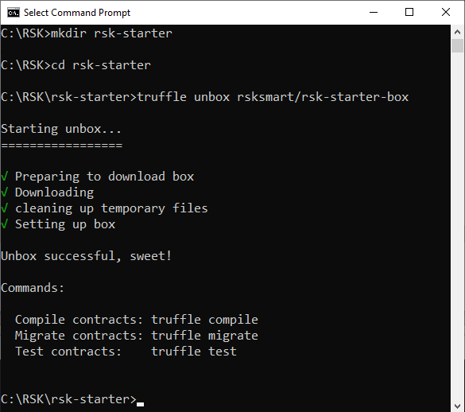

## SimpleStorage.sol

Take a look at the smart contract `SimpleStorage.sol`. You can check it out in the folder named `contracts`.

```solidity
pragma solidity >=0.4.0 <0.7.0;

contract SimpleStorage {
    uint storedData;

    function set(uint x) public {
        storedData = x;
    }

    function get() public view returns (uint) {
        return storedData;
    }
}
```

This smart contract has:

* A variable `storedData` to store a number
* A function `get()` to return the number stored at variable `storedData`
* A function `set()` to change the number stored at variable `storedData`

# Truffle development console

Truffle has an interactive console that also spawns a development blockchain. 
This is very useful for compiling, deploying and testing locally.

Run the development console by typing the following command below into the terminal:

```shell
truffle develop
```

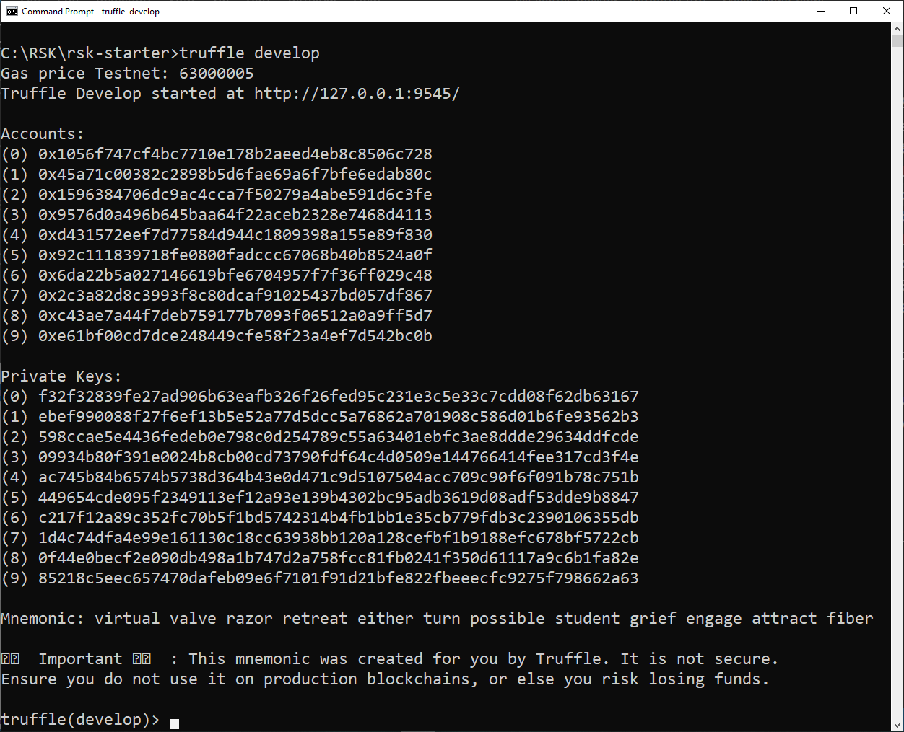

You are now in the truffle develop console with seeded accounts and their associated private keys listed.

> [!TIP]
> Inside the development console we don't preface commands with `truffle`.

# Compile a smart contract

In the Truffle console, run this command:

```javascript
compile
```

The compile output should be similar to:

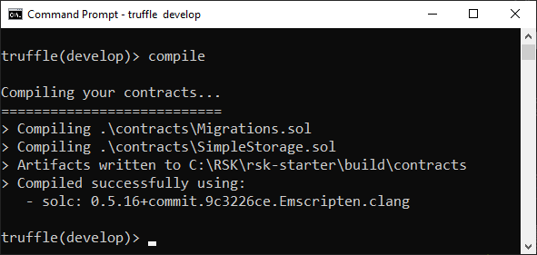

# Deploy a smart contract

To deploy a smart contract using Truffle, we need a new migrations file for Truffle to locate. 
This file contains instructions to deploy the smart contract. 

The `migrations` folder has JavaScript files that help you deploy contracts to the network. 
These files are responsible for staging your deployment tasks, and they're written under the assumption that your deployment needs will change over time. 
A history of previously run migrations is recorded on-chain through a special Migrations contract. 
(source: [truffle: running-migrations](https://www.trufflesuite.com/docs/truffle/getting-started/running-migrations))

Take a look in the file `2_deploy_contracts.js` located in the migrations folder. 

```javascript
const SimpleStorage = artifacts.require("SimpleStorage");
 
module.exports = function(deployer) {  
  deployer.deploy(SimpleStorage);
};
```

## Migrate

In the Truffle console, run this command:

```javascript
migrate
```

The migrate output should be similar to:

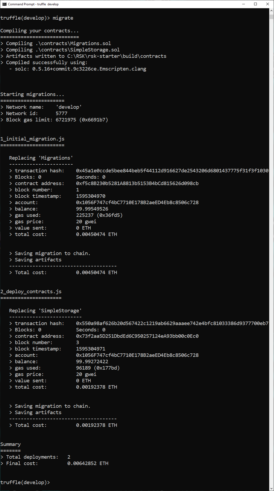

# Test a smart contract

Truffle has an automated testing framework to facilitate the testing of contracts.
All test files should be located in the `test` directory.
To learn more, go to the Truffle documentation, in the section [testing your contracts](https://www.trufflesuite.com/docs/truffle/testing/testing-your-contracts).

Our box also comes with the file `TestSimpleStorage.js` for testing the smart contract. 
You can check it out in the `test` folder.

```javascript
test
```

The test output should be similar to:

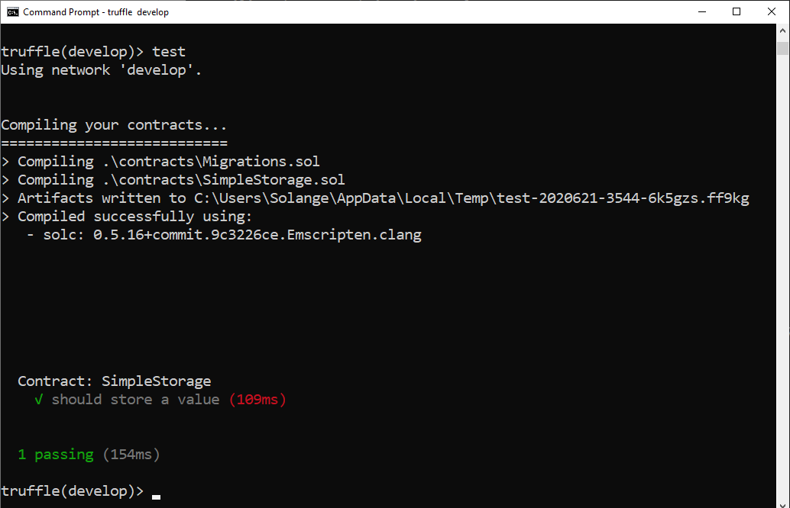

# Interact with a smart contract in development console

The next commands will run inside the development console.

```shell
truffle develop
```

> [!WARNING]
> Make sure you deploy the smart contract before executing this part.

## Connect with our published contract

```javascript
const simpleStorage = await SimpleStorage.deployed()
```

Now `simpleStorage` variable contains an instance of the previously deployed contract.

> [!NOTE]
> Don't worry about the `undefined` return, it is ok. 

## About SimpleStorage.json

The published contract information is stored by default in the `build\contracts` folder. 
You will find a JSON file with the same name of our smart contract.

The section `networks` contains the networks in which the smart contract was published, including its address and hash of the transaction.

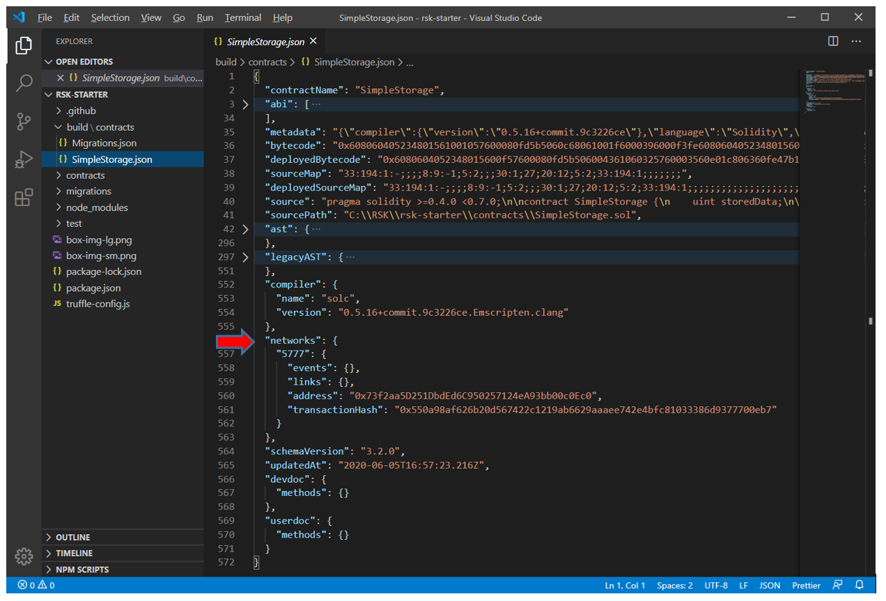

The ABI - Application Binary Interface is also very important because to connect with one smart contract, we must know the ABI and the address of the smart contract.

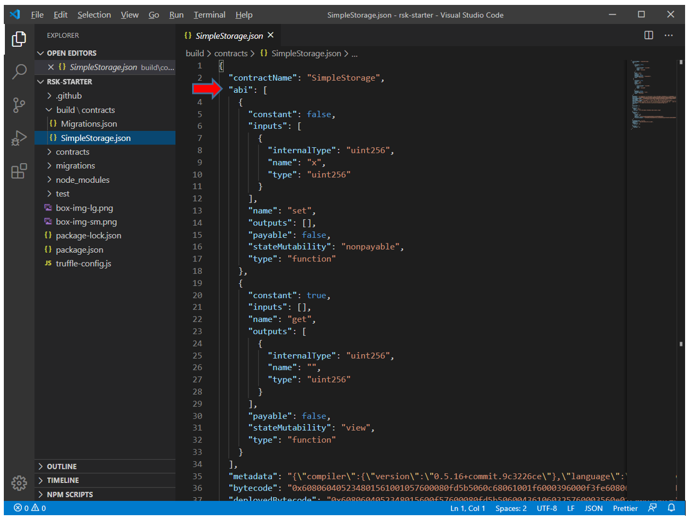

## Get value

Get the value stored in the contract.

```javascript
simpleStorage.get().then(bn => bn.toNumber())
```

We do not have any value stored, because we do not define anything at the moment when we deployed.

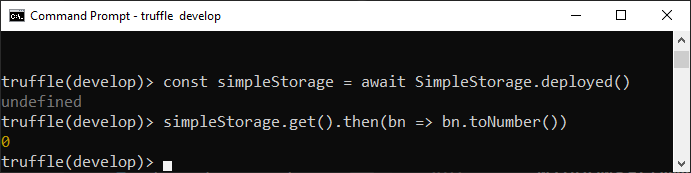

## Set value

Store some value in the contract.

```javascript
simpleStorage.set(10)
```

Have a look at the response.

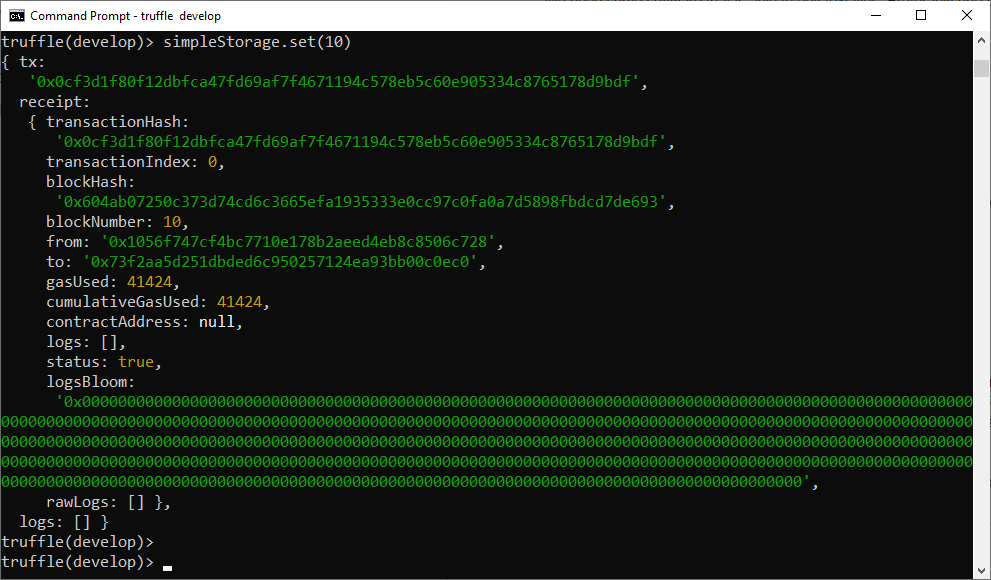

This is a transaction receipt, generated by the blockchain nodes, in response to the transaction request.

## Get value (again)

Verify if the value stored in the smart contract was changed.

```javascript
simpleStorage.get().then(bn => bn.toNumber())
```

The value now should be `10`!


# Using RSK networks

Truffle makes developing on RSK easier because we can configure custom networks for RSK. 
This Truffle box is already configured to connect to three RSK networks:

1. regtest (local node)
2. testnet
3. mainnet

> [!ATTENTION]
> TODO regtest

These networks are already configured in the `truffle-config.js` file.

Testnet will be used in this tutorial. For other networks:

**RSK regtest (Local node)**

To use the Truffle box connected to a local node, go to the tutorial 
[how to use Truffle connected to a local node](./en/truffle/truffle-regtest.md)

**RSK mainnet**

Follow the same instructions, just replacing `testnet` to `mainnet`. 
Some differences will be explained too.

# RSK testnet

We need to do some tasks:

- Setup an account / create a wallet
- Update .secret
- Connect to an RSK network
- Get tR-BTC
- Setup RSK network gas price
- Deploy in the network of your choose

## Create a wallet

The easy way to setup an account is using a web3 wallet injected in the browser.

I present tutorials for some options:
- [Metamask](./en/wallets/wallet-metamask.md)
- [Nifty](./en/wallets/wallet-nifty.md)

Select the RSK Network in the web wallet.

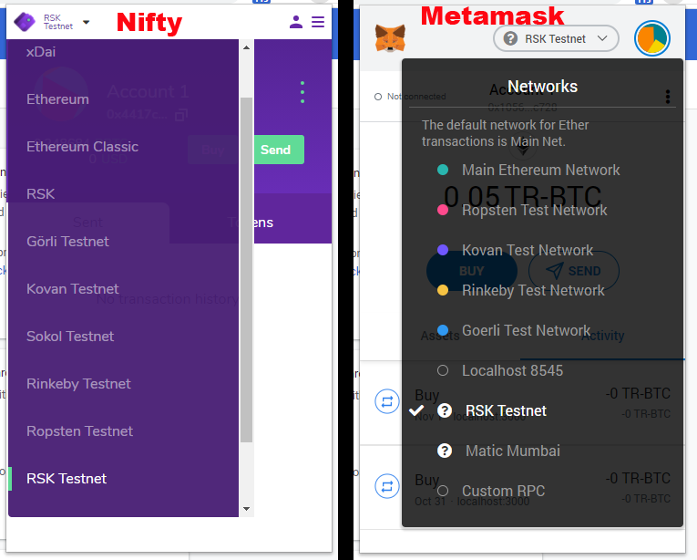

Take a look `truffle-config.js` file to realize that we are using `HDWalletProvider` with RSK Networks derivations path:
- RSK Testnet dpath: `m/44’/37310’/0’/0`
- RSK Mainnet dpath: `m/44’/137’/0’/0`

For more information, check [RSKIP57](https://github.com/rsksmart/RSKIPs/blob/master/IPs/RSKIP57.md).

## Update .secret file

After create your wallet, copy your mnemonic.

For example, my mnemonic is:

```
energy knife ice mouse merge track cram brown decorate atom rule virus
```

Paste the wallet mnemonic in the file `.secret`, located in the folder project, and save it.

# Connect to an RSK network

Run the development console for any RSK network.

<!-- tabs:start -->
#### ** RSK Testnet **

```shell
truffle console --network testnet
```

#### ** RSK Mainnet **

```shell
truffle console --network mainnet
```
<!-- tabs:end -->

This action instructs Truffle to connect to an RSK public node and grants it permission to control the accounts created with your mnemonic through the `HD wallet provider`.

Let's connect to the Testnet network:

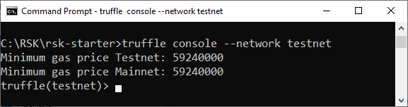

# Test the connection to RSK network

On any of the networks, run this commands in the Truffle console:

## Block number

Shows the last block number.

```javascript
(await web3.eth.getBlockNumber()).toString()
```

## Network ID

To get the network ID, run this command:

```javascript
(await web3.eth.net.getId()).toString()
```

> [!NOTE]
> List of network IDs:
> - mainnet: 30
> - testnet: 31
> - regtest (local node): 33

Check it out the last steps in this image:

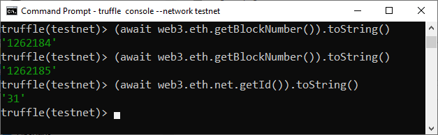

You can verify that I got the last block twice, and the block number inscreased, so we conclude that the connection is ok.

## Get your accounts 

```javascript
const accounts = await web3.eth.getAccounts()
```

> [!NOTE]
> Don't worry about the `undefined` return, it is ok. 

See the addresses after it by entering the command below:

```javascript
accounts
```

And to view each account:

```javascript
accounts[0]
accounts[1]
```

Copy the first account address, `accounts[0]`, to get some tR-BTCs later.

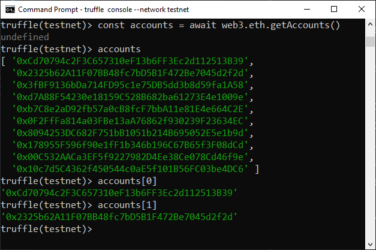

In my example, the account[0] is `0xCd70794c2F3C657310eF13b6FF3Ec2d112513B39`. 

## Check balance

To check the balance of account[0], for example, run this command in Truffle console:

```javascript
(await web3.eth.getBalance(accounts[0])).toString()
```

If the balance is 0, your need to get some R-BTC to pay gas fees,
which will be used to publish smart contracts and interact with them.
We shall obtain some R-BTC in the next step.

## Get R-BTC

The Smart Bitcoin (R-BTC) is used to pay for the execution of transactions in RSK.

<!-- tabs:start -->
#### ** RSK Testnet **

Get tR-BTC from [faucet](https://faucet.testnet.rsk.co/).

You can get more explanations on how to do it in 
[RSK faucet](./en/wallets/wallet-rsk-faucet.md) page.

#### ** RSK Mainnet **

For the RSK Mainnet, get R-BTC from [an exchange](https://www.rsk.co/#exchanges-rsk).
<!-- tabs:end -->


## Recheck balance

To check balance again, run this command in the Truffle console:

```javascript
(await web3.eth.getBalance(accounts[0])).toString()
```

For my example on RSK Testnet using account `0xCd70794c2F3C657310eF13b6FF3Ec2d112513B39`:

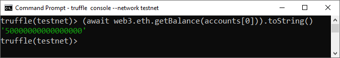

Great! Now I have 50000000000000000, which means that I have 0.05 tR-BTC with 18 decimal place of precision.

## Exit Truffle console

In the Truffle console, enter this command to exit the terminal:

```shell
.exit
```

## Setup the gas price

To update the **minimumGasPrice** in our project follow the tutorial 
[setup the gas price to use with Truffle](./en/truffle/truffle-rsk-gas-price.md). 

# Deploy the smart contract on RSK network

Let's now switch to interacting with a "real" blockchain,
which is running on multiple nodes distributed across multiple computers!

We will do it running the below commands directly in the terminal, 
without using the truffle console, this is to show you an alternative.

To use Testnet or Mainnet, you need to specify this using the parameter `-- network`. 
On any of the networks, run this commands in a terminal (not in Truffle console).

<!-- tabs:start -->
#### ** RSK Testnet **

```shell
truffle migrate --network testnet
```

#### ** RSK Mainnet **

```shell
truffle migrate --network mainnet
```

<!-- tabs:end -->

We'll do it on RSK testnet.

The migrate process in a real blockchain takes more time, because Truffle creates some transactions which need to be mined on the blockchain.

Wait a few minutes… 

:tada: Congratulations! :tada:

`Simple storage` is now published on the RSK network.

> [!ATTENTION]
> Make sure you have enough R-BTC to deploy it.


# Interact with a smart contract on RSK network

Interact with the simpleStorage smart contract using Truffle console connected to an RSK network.

It's the same as we did for Truffle development console, but now it will be for a real blockchain!

> [!ATTENTION]
> Make sure you deploy the smart contract before executing this part.

> [!NOTE]
> The next commands will run inside the Truffle console.

## Connect with our published contract

```javascript
const simpleStorage = await SimpleStorage.deployed()
```

Now simpleStorage variable contains an instance of the previously deployed contract.

## Get value

Get the value stored in the contract.

```javascript
simpleStorage.get().then(bn => bn.toNumber())
```

We do not have any value stored, because we do not define anything at the moment when we deployed.

> [!TIP]
This method does not modify the storage of the contract, so no funds are spent calling it.


## Set value

Store some value in the contract.

```javascript
simpleStorage.set(10)
```

To modify a contract's storage we must pay with gas. 
This gas is discounted from the account balance.

Take a look at the response.

> [!ATTENTION]
> TODO

This is a transaction receipt, generated by the blockchain nodes, in response to the transaction request.

## Get value (again)

To confirm that it was executed, we can call `get` function again and see that the storage has changed.

```javascript
simpleStorage.get().then(bn => bn.toNumber())
```

The value now should be `10`!

# Final considerations

In this tutorial you learned how to use the Truffle box [rsk-starter-box](https://github.com/rsksmart/rsk-starter-box), 
which comes with everything you need to start using Truffle on RSK networks. 

I hope this tutorial has been helpful and I'd appreciate your feedback. 
Share it if you like it :)

**Do you have questions?**

Ask in [RSK chat](https://gitter.im/rsksmart/getting-started)
