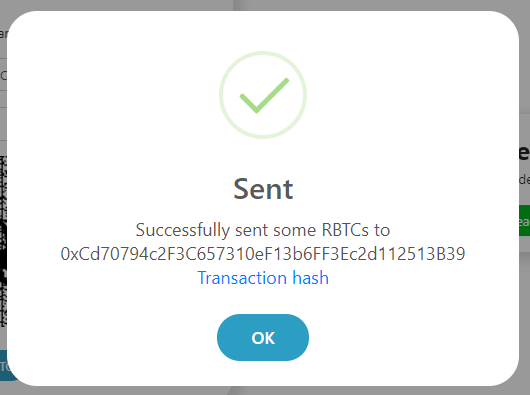

# Truffle boxes prerequisites

Before you use a Truffle box, you need to have Truffle and other useful tools installed in your computer.
In this tutorial, I will show you step-by-step on how to install and configure the prerequisites to use any RSK Truffle box on RSK networks.

# Overview

Some requirements have already been explained to the Truffle itself, in the tutorial 
[Truffle project prerequisites](./en/truffle/truffle-project-prerequisites.md) 
 
1. [Git](./en/truffle/truffle-project-prerequisites?id=git)
2. [POSIX compliant shell](./en/truffle/truffle-project-prerequisites?id=posix-compliant-shell)
3. [cURL](./en/truffle/truffle-project-prerequisites?id=curl)
4. [Node.js and NPM](./en/truffle/truffle-project-prerequisites?id=nodejs-and-npm)
5. [Code editor](./en/truffle/truffle-project-prerequisites?id=code-editor)
6. [Truffle framework](./en/truffle/truffle-project-prerequisites?id=truffle-framework)


Also you must do:

7. [Create a wallet mnemonic](#create-a-wallet-mnemonic)
8. [HD wallet provider](#hd-wallet-provider)
9. [Get RBTC](#get-r-btc)


# Create a wallet mnemonic

To use testnet, we need tRBTC and an address to store them.
The best way is to create a wallet from a mnemonic, using the pattern defined at [BIP39](https://github.com/bitcoin/bips/blob/master/bip-0039.mediawiki)

There are a few ways to do this.

One is to create using a web wallet, 
such as [Metamask](https://metamask.io/) 
or [Nifty](https://www.poa.network/for-users/nifty-wallet) wallet.
These wallets generate the mnemonic for you.

### iancoleman.io/bip39

Another way is using this web app:

[iancoleman.io/bip39](https://iancoleman.io/bip39/)

> Note: In this tutorial, the method used to store the mnemonic is not recommended to be used for any 'real' wallet because it's not secure enough to generate a private key in a website, however we will use this here for learning purposes, and because we're using the Testnet, so no real amounts are at stake.

In the `Generate a random mnemonic` field, select `12 words` and click on the `generate` button.


The result appears in the `BIP39 Mnemonic` field.
They should be 12 random words like the words in the image:


My mnemonic is:

```
energy knife ice mouse merge track cram brown decorate atom rule virus
```

Copy these 12 words, we'll use it later.

RSK Networks have their own derivation path. Learn more about [account based RSK addresses](/rsk/architecture/account-based/ "Account based RSK addresses - RSK developers portal").

# HD wallet provider

To connect to the RSK network, we are going to use a provider that allows us to connect to any network by unlocking an account locally. 
We are using `@truffle/hdwallet-provider`. It will be installed with the Truffle box.

Please be aware that we are using `HDWalletProvider` with RSK Networks derivations path:
- RSK Mainnet dpath: `m/44’/137’/0’/0`
- RSK Testnet dpath: `m/44’/37310’/0’/0`

For more information, check [RSKIP57](https://github.com/rsksmart/RSKIPs/blob/master/IPs/RSKIP57.md).

# Get RBTC

The Smart Bitcoin (RBTC) is the token used to pay for the execution of transactions in RSK.

**Mainnet**

For the RSK Mainnet, get RBTC from [an exchange](https://www.rsk.co/#exchanges-rsk).

**Testnet**

For the RSK Testnet, get tRBTC from this [faucet](https://faucet.testnet.rsk.co/).


Enter your wallet address and pass the CAPTCHA.

For example, I will get some tR-BTCs for this address: `0xCD70794c2f3c657310EF13b6Ff3EC2d112513b39`.

Wait a few seconds…



You can see the transaction hash:
[`0xe7a25985f019482d362a3be908f1c0b3dee612fcc78716b6a341d8ad6138ea95`](https://explorer.testnet.rsk.co/tx/0xe7a25985f019482d362a3be908f1c0b3dee612fcc78716b6a341d8ad6138ea95)

# Next steps

- Go to [RSK Truffle boxes](/tools/truffle/boxes/) and choose your box.
