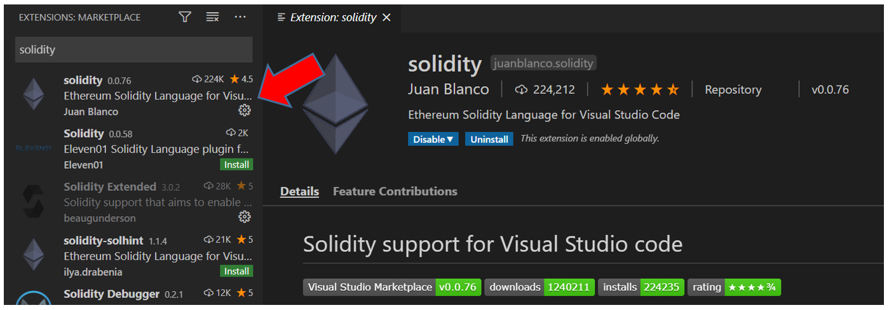

# Truffle project prerequisites

Before you create a Truffle project, you need to have Truffle and other useful tools installed in your computer.
In this tutorial, I will show you step-by-step on how to install and configure the prerequisites to use Truffle framework.

# Overview

Here is a summary of the requirements to install and actions we will take in this tutorial:

1. [Git](#git)
2. [POSIX compliant shell](#posix-compliant-shell)
3. [cURL](#curl)
4. [Node.js and NPM](#nodejs-and-npm)
5. [Code editor](#code-editor)
6. [Truffle framework](#truffle-framework)

# Git

[Git](https://git-scm.com/doc) is version control system, which is used for some other dependencies. Also it has some utilities, like `Git Bash`.

Maybe Git may already be installed. To find out, open a terminal and enter:

```shell
git --version
```

There are several ways to install Git. 
Check it out in the tutorial [Install Git](https://www.atlassian.com/git/tutorials/install-git)

**Windows OS**

There are other options for Windows:
- [Installer for Windows](https://git-scm.com/download/win).
- [Git for Windows](https://gitforwindows.org/).

# POSIX compliant shell

The **Portable Operating System Interface (POSIX)** is a family of standards specified by the IEEE Computer Society for maintaining compatibility between operating systems. POSIX defines the application programming interface (API), along with command line shells and utility interfaces, for software compatibility with variants of Unix and other operating systems.
Source: [Wikipedia](https://en.wikipedia.org/wiki/POSIX)

* Mac OSX and Linux distributions: Use the standard terminal
* Windows: If you use the standard `cmd` terminal, or `PowerShell`, the commands here may not work.
  Consider using `Git Bash` which was installed in the previous step.
  Here is a [Tutorial on installing and using Git Bash](https://www.atlassian.com/git/tutorials/git-bash).

# cURL

This is a system command that is likely already installed on your system,
which allows you to make network requests, such as HTTP requests,
from your command line.

If `curl --version` displays an error,
then [download curl](https://curl.haxx.se/download.html).

In Windows:

```windows-command-prompt
C:\>curl --version
curl 7.55.1 (Windows) libcurl/7.55.1 WinSSL
Release-Date: [unreleased]
Protocols: dict file ftp ftps http https imap imaps pop3 pop3s smtp smtps telnet tftp
Features: AsynchDNS IPv6 Largefile SSPI Kerberos SPNEGO NTLM SSL

C:\>
```

# Node.js and NPM

Another dependency is NPM, which comes bundled with Node.js.

To check if you have node already installed, enter this command into your terminal:

```shell
node --version
npm --version
```

This is the result in a Windows OS:

```windows-command-prompt
C:\>node --version
v10.16.3

C:\>npm --version
v6.9.0

C:\>
```

If there's no output like the one above, here's how to install it on Ubuntu, Mac OSX and Windows.

[](#top "multiple-terminals")
- Linux
  ```shell
  sudo apt update
  sudo apt install curl git
  curl -sL https://deb.nodesource.com/setup_12.x | sudo -E bash -
  sudo apt install nodejs
  ```
- Mac OSX
```shell
  curl -o- https://raw.githubusercontent.com/creationix/nvm/v0.35.2/install.sh | bash
  nvm install 12
  nvm use 12
  nvm alias default 12
  npm install npm --global # Upgrade npm to the latest version
``` 

### Windows OS
Installing Node.js on Windows requires a few manual steps.

go to [Node.js](https://nodejs.org/en/) to download and install it.

### Comments about Node.js and NPM

NPM is usually installed together with Node.js, so after installing Node.js, there's no need to install it separately.

If you want to have more than one version installed,
the most fuss-free way to install and manage multiple versions of `node` on your computer is 
[nvm](https://github.com/nvm-sh/nvm). Note that `nvm` was used in Mac OSX.

# Code editor

We need some software that is able to edit text files.
Preferably one that has support for syntax highlighting for both Solidity and Javascript.

[VS Code](https://code.visualstudio.com/) is a good choice if you don't already have one.

## Visual Studio Code (VS Code)

In this tutorial, we will use VS Code to create our project.

Go to [VS Code download](https://code.visualstudio.com/download) if you would like to use it too.

Verify if your VS Code installation was successful by typing the following command into the terminal:

```shell
code -v
```

```windows-command-prompt
C:\>code -v
1.45.1
5763d909d5f12fe19f215cbfdd29a91c0fa9208a
x64

C:\>
```

## VSCode extension for Solidity

If you decided to use VSCode, it is great to have Solidity support. 
I use the solidity extension from [Juan Blanco](https://marketplace.visualstudio.com/items?itemName=JuanBlanco.solidity).

To install it, go to extensions (Menu View -> Extensions):

1. Type `solidity` in the search field.
2. Select `solidity`  extension from Juan Blanco.
3. Click `install`.



# Truffle framework

[Truffle framework](https://www.trufflesuite.com/truffle) is a popular development framework with a mission to make smart contract development easier for developers. Amongst its features, it has a smart contract lifecycle management, scriptable deployment & migrations, automated contract testing and simple network management.

It also makes developing on RSK easier, with the ability to configure custom networks for RSK.

To install Truffle, we only need one command to install `Truffle`:

```shell
npm install -g truffle
```

```windows-command-prompt
C:\>npm install -g truffle
C:\Program Files\nodejs\truffle -> C:\Program Files\nodejs\node_modules\truffle\build\cli.bundled.js

> truffle@5.1.28 postinstall C:\Program Files\nodejs\node_modules\truffle
> node ./scripts/postinstall.js

- Fetching solc version list from solc-bin. Attempt #1
+ truffle@5.1.28
updated 1 package in 11.679s

C:\>
```

To verify that `Truffle` is installed properly,
close the terminal, open it again and check the `Truffle` version:

```shell
truffle version
```

```windows-command-prompt
C:\>truffle version
Truffle v5.1.28 (core: 5.1.28)
Solidity v0.5.16 (solc-js)
Node v10.16.3
Web3.js v1.2.1

C:\>
```

If you see an error, make sure that npm modules are added to your path.

# Final message

Congratulations!
You are ready to start your Blockchain developer journey using Truffle framework :)
