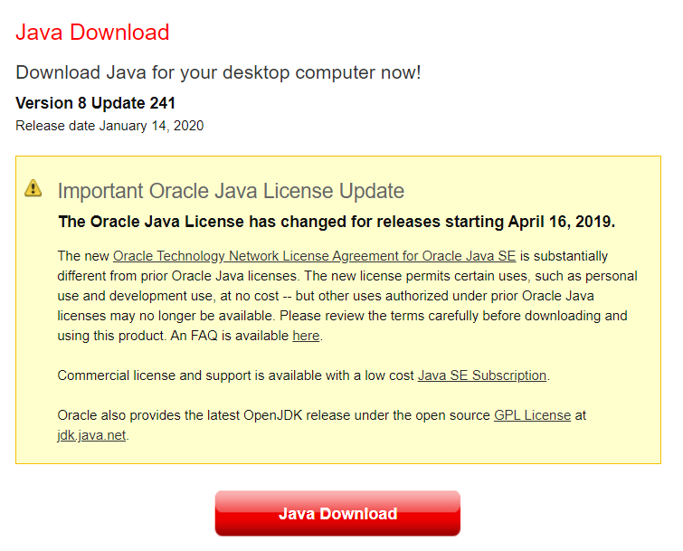
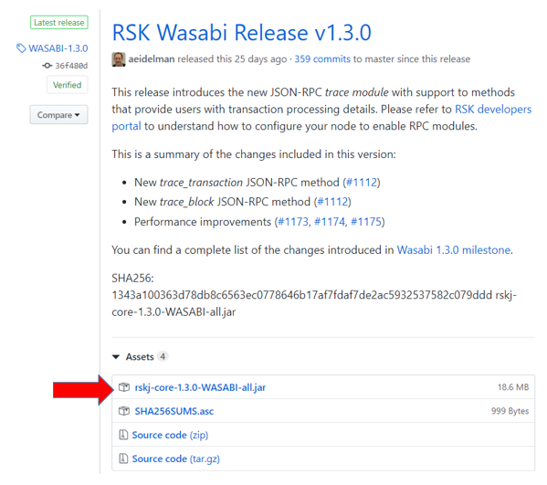
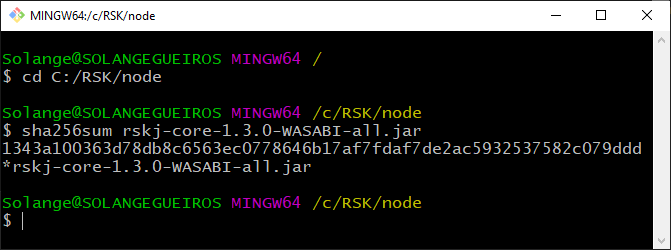
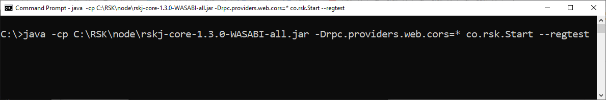
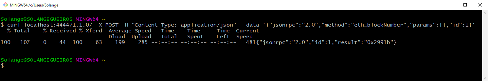
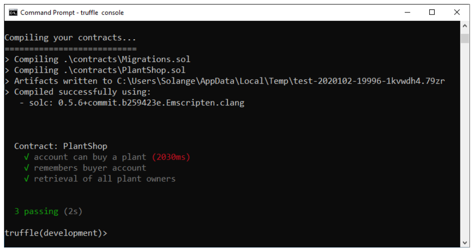
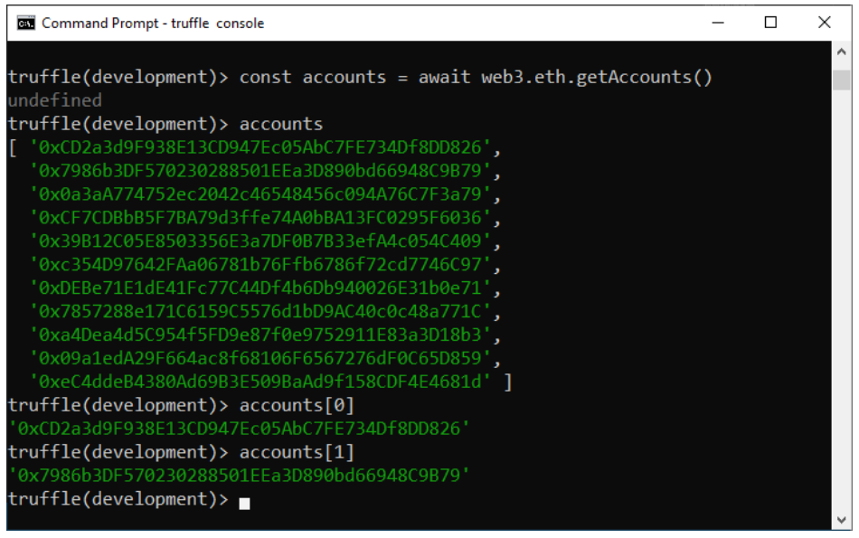

# How to connect Truffle to regtest, the RSK local node

In this tutorial, I will show you step-by-step how to configurate Truffle to connect to regtest, the RSK local node.


# Overview

Here is a summary of the steps to be taken to use Truffle connected to a local node:

1. [Requirements](#requirements);
2. [Install an RSK local node](#install-an-rsk-local-node);
3. [Run the regtest node](#run-the-regtest-node);
4. [Check if the node is running](#check-if-the-node-is-running);
5. [Truffle console on regtest (local node)](#truffle-console-on-regtest-local-node);
6. [Configure the truffle-config file](#configure-the-truffle-config-file);
7. [Compile and migrate the smart contracts](#compile-and-migrate-the-smart-contracts);
8. [Test a smart contract](#test-a-smart-contract);
9. [Get your accounts](#get-your-accounts);
10. [Connect with your published contract](#connect-with-your-published-contract);
11. [Interact with your smart contract](#interact-with-your-smart-contract).


# Requirements

There are a few technical requirements before we start. 
To use Truffle, you need to have installed in your computer:

1. [Git](./en/truffle/truffle-project-prerequisites?id=git)
2. [POSIX compliant shell](./en/truffle/truffle-project-prerequisites?id=posix-compliant-shell)
3. [cURL](./en/truffle/truffle-project-prerequisites?id=curl)
4. [Node.js and NPM](./en/truffle/truffle-project-prerequisites?id=nodejs-and-npm)
5. [Code editor](./en/truffle/truffle-project-prerequisites?id=code-editor)
6. [Truffle framework](./en/truffle/truffle-project-prerequisites?id=truffle-framework)

If you don't have any of them installed, go to the tutorial [Truffle project prerequisites](./en/truffle/truffle-project-prerequisites.md) which have all the instructions to setup these requirements.

And, specifically for the local node, you need to have installed in your computer:
- Java
- RSKj

## Java

You will need Java 8 in order to run RSKj.

Check if you already have Java installed:

```shell
java -version
```

This is the result on Windows OS:

```windows-command-prompt
C:\>java version
java version "1.8.0_241"
Java(TM) SE Runtime Environment (build 1.8.0_241-b07)
Java HotSpot(TM) Client VM (build 25.241-b07, mixed mode)

C:\>
```

If `java -version` displays an error,
or displays a version other than 1.8,
you will need to install it.

### Install Java

<!-- tabs:start -->

#### ** Linux **

There are a variety of ways to do this, and SDKman is one which allows you to install and switch between multiple versions as needed:

```shell
curl -s "https://get.sdkman.io/" | bash
source "$HOME/.sdkman/bin/sdkman-init.sh"
# to get a filtered list of available java versions
sdk list java  | grep "8\." # copy a selection for use below

# install the version of java copied above
# (replace accordingly)
sdk install java 8.0.242.j9-adpt

# show installed versions, and switch to the selected one
# (replace accordingly)
sdk list java | grep installed
sdk use java 8.0.242.j9-adpt
java -version
```

#### ** Mac OS **

There are a variety of ways to do this, and SDKman is one which allows you to install and switch between multiple versions as needed:

```shell
curl -s "https://get.sdkman.io/" | bash
source "$HOME/.sdkman/bin/sdkman-init.sh"
# to get a filtered list of available java versions
sdk list java  | grep "8\." # copy a selection for use below

# install the version of java copied above
# (replace accordingly)
sdk install java 8.0.242.j9-adpt

# show installed versions, and switch to the selected one
# (replace accordingly)
sdk list java | grep installed
sdk use java 8.0.242.j9-adpt
java -version
```

#### ** Windows OS **

Go to the official [Java download](https://www.java.com/en/download/) page,
download, and run the installer from there.



<!-- tabs:end -->


# Install an RSK local node

RSKj is the software for running RSK nodes.

There are [several ways](https://developers.rsk.co/rsk/node/install/) to set up a RSK local node. 
Here, we will download a JAR file and run it using the Java SDK that has been installed.

## Download

Go to the [releases page](https://github.com/rsksmart/rskj/releases) and select the most recent to download it.

You need to click the JAR file, in the end of the post about the lastest release.
It's name should be `rskj-core-*.jar`:



## Verify authenticity

When installing and running the RSKj node,
it is always a good idea to verify that your copy is legitimate.

In the folder where you download the JAR file, go to a POSIX terminal and run this command:

```shell
sha256sum rskj-core-2.0.1-PAPYRUS-all.jar
```

For this version, it looked like this:

```shell
43149abce0a737341a0b063f2016a1e73dae19b8af8f2e54657326ac8eedc8a0 *rskj-core-2.0.1-PAPYRUS-all.jar
```



> Note that if you are using Windows, you will need a POSIX compliant shell for this.

For more information about verifying that your copy is legitimate,
including signature verification, check out the
[full instructions](https://developers.rsk.co/rsk/node/security-chain/ "Verify authenticity of RskJ source code and its binary dependencies") 
on how to do this.

# Run the regtest node

To run the node:

```shell
java -cp <PATH-TO-THE-RSKJ-JAR> -Drpc.providers.web.cors=* co.rsk.Start --regtest
```

Replace `<PATH-TO-THE-RSKJ-JAR>` with your path to the JAR file. 

As an example, the commands required to run the RSK node in different environments are:

<!-- tabs:start -->
#### ** Linux **

```shell
java -cp ~/Rsk/node/rskj-core-2.0.1-PAPYRUS-all.jar -Drpc.providers.web.cors=* co.rsk.Start --regtest
```

#### ** Mac OS **

```shell
java -cp ~/RSK/node/rskj-core-2.0.1-PAPYRUS-all.jar -Drpc.providers.web.cors=* co.rsk.Start --regtest
```

#### ** Git Bash **

```shell
java -cp C:/RSK/node/rskj-core-2.0.1-PAPYRUS-all.jar -Drpc.providers.web.cors=* co.rsk.Start --regtest
```

#### ** Windows OS **

I am using a Windows OS and I saved the file at `C:\RSK\node`,
so for me the full path is `C:\RSK\node\rskj-core-2.0.1-PAPYRUS-all.jar`.

```shell
java -cp C:\RSK\node\rskj-core-2.0.1-PAPYRUS-all.jar -Drpc.providers.web.cors=* co.rsk.Start --regtest
```
<!-- tabs:end -->

If you see no output - that is a good thing:
Its output is directed to a log file.

This is the result in the terminal in Windows OS, for WASABI, an old node version:



> Note the flag provided above: `-Drpc.providers.web.cors=*`.
> 
> This disables cross origin resource sharing protection,
> effectively allowing any web page to access it.
> As we want to make JSON-RPC requests from a browser,
> such as a DApp, we need this flag.

**Important:**

> Do not close this terminal/console window,
> if closed the local node will stop running.

# Check if the node is running

In order to be sure that the node is properly running, we will run a cURL command connecting to the node.
Open a new terminal window. 
In Windows OS, I recommend to use `Git Bash`.

Issue a JSON-RPC request to the RSK node's HTTP server.

This is an example using cURL:

```shell
curl localhost:4444/1.1.0/ -X POST -H "Content-Type: application/json" --data '{"jsonrpc":"2.0","method":"eth_blockNumber","params":[],"id":1}'
```



The response should look similar to this:

```json
{"jsonrpc":"2.0","id":1,"result":"0x2991b"}
```

The `result` property is the number of the latest block that has been synced. Note that this value (`0x2991b`) is the block number in hexadecimal (base 16), so the output above indicates that the current block number is `170267` in decimal (base 10).

If you do it again after some seconds, the block number will increase and this demonstrates that block are been mining.

* To get more information about this process,
  check out [set up RSKj with Java](https://developers.rsk.co/rsk/node/install/java/).
* If you encounter any problems, check if your system meets the
  [minimum requirements](https://developers.rsk.co/rsk/node/install/requirements/).
* There are other ways to install an RSK node, in other supported platforms:
  check out [installing RSKj](https://developers.rsk.co/rsk/node/install/).

# Configure the truffle-config file

Open `truffle-config.js` file located in your Truffle project folder:

Update the configuration for regtest at `network` section:

```javascript
module.exports = {
  // ...
  networks: {
    // ...
    development: {
      host: "127.0.0.1",
      port: 4444,
      network_id: "*"
    },
    // ...
  },
  // ...
}
```

# Truffle console on regtest (local node)

> First ensure you have a local node running.

In the terminal, inside your project folder, run this command:

```shell
truffle console
```

> Any network defined with the name development is considered the default network.

For example, I will do it in the folder `C:\RSK\rsk-plant`, where I did the unbox of [rsk-plant-box](https://github.com/rsksmart/rsk-plant-box).


```windows-command-prompt
C:\>cd C:\RSK\rsk-plant

C:\RSK\rsk-plant>truffle console

truffle(development)> 
```

If you would like to try the `rsk-plant-box`, go to the tutorial [rsk-plant-box](./en/truffle-boxes/rsk-plant-box).

## Test the connection to RSK network

You can run these commands in Truffle console connected to any RSK network.

### Block number

Shows the last block number.

```javascript
(await web3.eth.getBlockNumber()).toString()
```

### Network ID

To get the network ID, run this command:

```javascript
(await web3.eth.net.getId()).toString()
```

List of network IDs:
- mainnet: 30
- testnet: 31
- regtest (local node): 33

So, for the local node, the network ID is `33`.

```windows-command-prompt
truffle(development)> (await web3.eth.getBlockNumber()).toString()
'655568'
truffle(development)> (await web3.eth.net.getId()).toString()
'33'
truffle(development)> (await web3.eth.getBlockNumber()).toString()
'655581'
truffle(development)> 
```

You can verify that I got the last block twice, and the block number inscreased, so we conclude that the connection is ok.

# Compile and migrate the smart contracts

When you run the `migrate` command, it will automatically compile the smart contract too.

```shell
truffle migrate
```

```windows-command-prompt
truffle(development)> migrate

Compiling your contracts...
===========================
> Compiling .\contracts\Migrations.sol
> Compiling .\contracts\PlantShop.sol
> Artifacts written to C:\RSK\rsk-plant\build\contracts
> Compiled successfully using:
   - solc: 0.5.6+commit.b259423e.Emscripten.clang

Starting migrations...
======================
> Network name:    'development'
> Network id:      33
> Block gas limit: 6800000 (0x67c280)


1_initial_migration.js
======================

   Deploying 'Migrations'
   ----------------------
   > transaction hash:    0xc622eaa343f966780275ef157138f3b76ece72e2791f16fb54acbcc2f2d86d86
   > Blocks: 0            Seconds: 0
   > contract address:    0x3762c9837087e22c2ceD79aA0163439Ac2b4249B
   > block number:        654983
   > block timestamp:     1604355406
   > account:             0xCD2a3d9F938E13CD947Ec05AbC7FE734Df8DD826
   > balance:             999999999899.13683244
   > gas used:            186135 (0x2d717)
   > gas price:           20 gwei
   > value sent:          0 ETH
   > total cost:          0.0037227 ETH

   > Saving migration to chain.
   > Saving artifacts
   -------------------------------------
   > Total cost:           0.0037227 ETH


2_deploy_contracts.js
=====================

   Deploying 'PlantShop'
   ---------------------
   > transaction hash:    0x4da03dccfdde8ac0539597c638b9df26d83b97c4fe667c8dba881be86293595d
   > Blocks: 0            Seconds: 0
   > contract address:    0x54bAf1c909Bf5426B7254018b4A76F3584183801
   > block number:        654987
   > block timestamp:     1604355411
   > account:             0xCD2a3d9F938E13CD947Ec05AbC7FE734Df8DD826
   > balance:             999999999899.13124108
   > gas used:            237567 (0x39fff)
   > gas price:           20 gwei
   > value sent:          0 ETH
   > total cost:          0.00475134 ETH

   > Saving migration to chain.
   > Saving artifacts
   -------------------------------------
   > Total cost:          0.00475134 ETH

Summary
=======
> Total deployments:   2
> Final cost:          0.00847404 ETH

truffle(development)>    
```

# Test a smart contract

A local node speeds up the development process because we can do the tests locally, 
without wasting time waiting for mined blocks.

If you already write tests, run it inside the Truffle console:

```shell
test
```

For example, take a look in the results of my tests of the [rsk-plant-box](https://github.com/rsksmart/rsk-plant-box).



# Get your accounts 

The regtest comes with a list of 10 unlocked accounts. 
We will store them in a variable called `accounts`:

```javascript
const accounts = await web3.eth.getAccounts()
```

Don’t worry about the `undefined` return, it is ok. See the addresses after it by entering the command below:

```javascript
accounts
```

And to view each account:

```javascript
accounts[0]
accounts[1]
```

Take a look in the results:


# Connect with your published contract

> Make sure you had deployed the smart contract before executing this part.

In the Truffle console, run this command to connect with the deployed smart contract:

```javascript
const instance = await Contract.deployed()
```

Now `instance` variable contains an instance of `Contract`, the previously deployed contract.

```windows-command-prompt
truffle(develop)> const instance = await Contract.deployed()
undefined
truffle(develop)>  
```

Don't worry about the `undefined` return, it is ok. 

## Confirm if the instance is OK.

Enter the instance's name:  `instance`, then `.` (dot), and, without space, hit the TAB button twice to trigger auto-complete as seen below. 
This will display the published address of the smart contract, the transaction hash for its deployment, among other things, including all public variables and methods available.

```javascript
instance. [TAB] [TAB]
```

# Interact with your smart contract

Now you can execute the smart contract's functions, in the same way you can do it in Truffle console connected to other networks.

# Final considerations

In this tutorial you have learned how install, run a RSK local node and configure Truffle to connect in this network.
Also you see how to compile, migrate and test smart contracts, get your accounts and create an instance of smart contract, interacting with it.

**Do you have questions?**

Ask in [RSK chat](https://gitter.im/rsksmart/getting-started)
