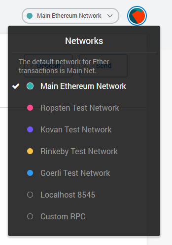
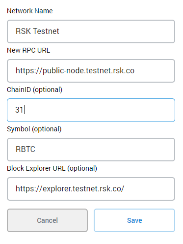
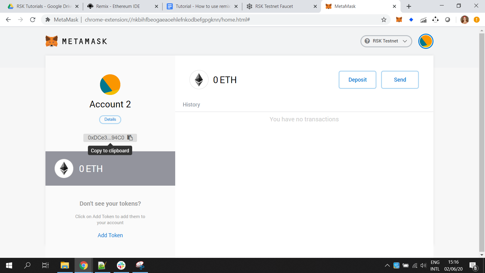

# Connect Metamask to RSK testnet

- Go to networks
- Custom RPC

- Network Name

  `RSK Testnet`
- New RPC URL

  [`https://public-node.testnet.rsk.co`](https://public-node.testnet.rsk.co)
- ChainID (optional)

  `31`
- Symbol (optional)

  `tR-BTC`
- Block Explorer URL (optional)

  [`https://explorer.testnet.rsk.co`](https://explorer.testnet.rsk.co)

> [!TIP]
> If you had problems with ChainID use 0x1f (31 in hexadecimal)

## Select RSK testnet

After configuring it, select the RSK Tesnet.

## Get tR-BTC

Copy your address from Metamask.

Now you can follow the instructions to get some [Testnet R-BTC](./en/wallets/wallet-rsk-faucet.md). 

When you come back, you will have 0.05 tR-BTC, like me!

