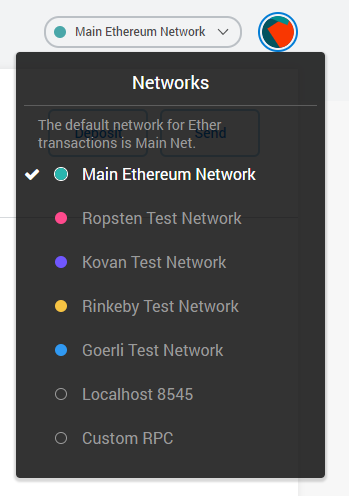
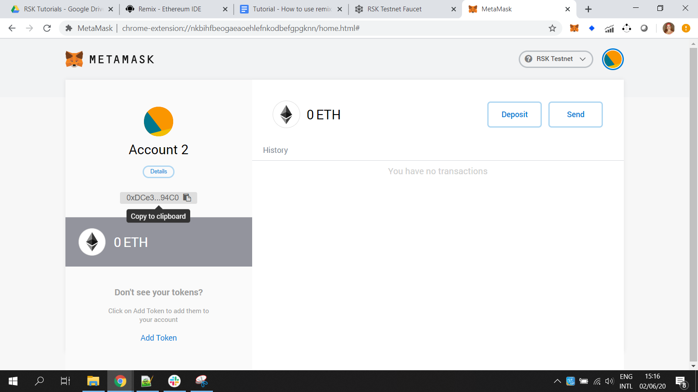
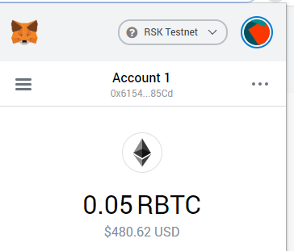

# Metamask

[Metamask](https://metamask.io/) is a kind of web wallet which facilitates transactions using yours accounts.
It can be used with RSK networks too.
It has versions for several browsers, like Chrome, Firefox, Opera and Brave.

## Install Metamask

Go to [metamask.io](https://metamask.io/) and install it.

Create an account.

Write down your seed phrase, or mnemonic, or backup phrase (all these terms mean the same), with 12 words. This is used to recover your account, in case you lose your password.

The seed phrase is the most important thing in a wallet / account!

## Configure to connect to RSK testnet

- Go to networks
- Custom RPC

- Network Name

  `RSK Testnet`
- New RPC URL

  [`https://public-node.testnet.rsk.co`](https://public-node.testnet.rsk.co)
- ChainID (optional)

  `31`
- Symbol (optional)

  `tR-BTC`
- Block Explorer URL (optional)

  [`https://explorer.testnet.rsk.co`](https://explorer.testnet.rsk.co)

> If you had problems with ChainID use 0x1f (31 in hexadecimal)

## Select RSK testnet

After configuring it, select the RSK Tesnet.

## Get tR-BTC

Copy your address from Metamask.

Now you can follow the instructions to get some [Testnet R-BTC](./en/wallets/wallet-rsk-faucet.md). 

When you come back, you will have 0.05 tR-BTC, like me!

