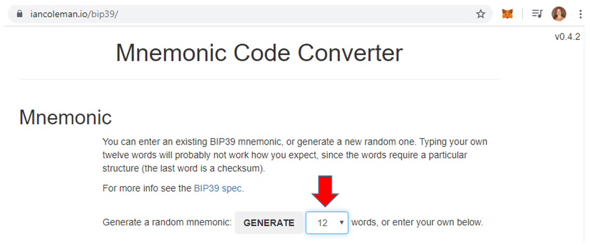
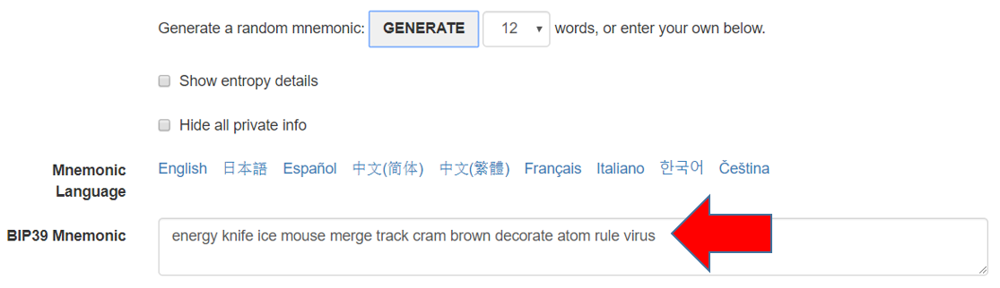

# Create a wallet from a mnemonic

A way to create a wallet is from a mnemonic, using the pattern defined at [BIP39](https://github.com/bitcoin/bips/blob/master/bip-0039.mediawiki).

The `mnemonic`, also knows as `seed phrase`, is the most important thing in a wallet / account!
If yu lost it, you will loose your money.

## iancoleman.io/bip39

This web app [iancoleman.io/bip39](https://iancoleman.io/bip39/) creates a mnemonic:

* [iancoleman.io/bip39](https://iancoleman.io/bip39/)

> Note: In this tutorial, the method used to store the mnemonic is not recommended to be used for any 'real' wallet because it's not secure enough to generate a private key in a website, however we will use this here for learning purposes, and because we're using the Testnet, so no real amounts are at stake.

In the `Generate a random mnemonic` field, select `12 words` and click on the `generate` button.



The result appears in the `BIP39 Mnemonic` field.
They should be 12 random words like the words in the image:



My mnemonic is:

```
energy knife ice mouse merge track cram brown decorate atom rule virus
```

Copy these 12 words, we'll use it later in our projects.

RSK Networks have their own derivation path. You can learn more about it in [account based RSK addresses](https://developers.rsk.co/rsk/architecture/account-based/ "Account based RSK addresses - RSK developers portal").

## mnemonics module

Another alternative to generate a mnemonic is using the package [mnemonics](https://github.com/itinance/mnemonics),
which is a simple utility that can be used to generate [BIP39](https://github.com/bitcoin/bips/blob/master/bip-0039.mediawiki) mnemonics.

To install `mnemonics` globally, input the command below into the terminal and press `enter` at your project location:

```shell
npm install -g mnemonics@1.1.3
```

Use this to generate a 12-word BIP39 mnemonic and save it in a file, by entering this command:

```shell
mnemonics > .secret
```

This saves a new mnemonic in the file named `.secret`.

