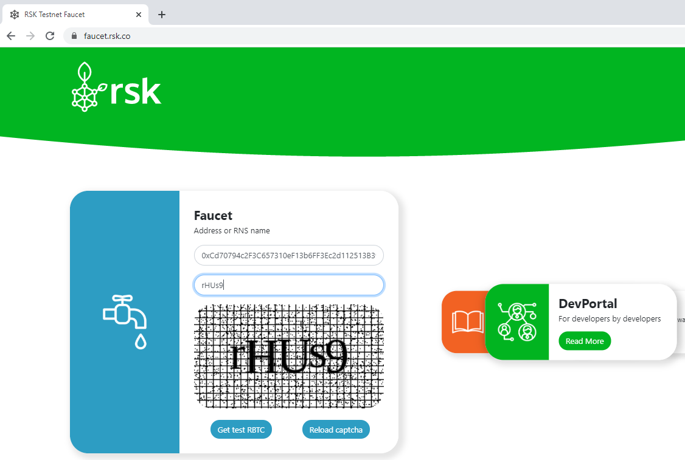

# Faucet tR-BTCs

Enter your wallet address and pass the CAPTCHA.

For example, I will get some tR-BTCs for this address: `0xCD70794c2f3c657310EF13b6Ff3EC2d112513b39`.

Wait a few seconds…

You can see the transaction hash:
[`0xe7a25985f019482d362a3be908f1c0b3dee612fcc78716b6a341d8ad6138ea95`](https://explorer.testnet.rsk.co/tx/0xe7a25985f019482d362a3be908f1c0b3dee612fcc78716b6a341d8ad6138ea95)
