# Cómo usar RSKSwap con smart contracts

RSKSwap es un exchange descentralizado, que permite cambiar tokens ERC20 automáticamente, no hay necesidad de esperar a un comprador o un vendedor. 
Cuenta con la ventaja de los bajos costos y seguridad de la red RSK. 
Además no requiere KYC y no tiene límites para retiros o depósitos.

En este post te mostraré una guía paso a paso sobre cómo crear tu propio token e intercambialo en RSKSwap programáticamente, usando smart contracts.

Para saber más, puedes leer la Documentación de RSKSwap.


# Resumen

A continuación se muestra un resumen de los pasos que vamos a seguir:

1. Conexión de Metamask con RSK testnet;
2. Solicitar testnet R-BTCs en faucet;
3. Conexión de Remix con RSK testnet; 
4. Crear un token;
5. RSKSwap - UniswapV2Router02
6. Agregar liquidez en RSKSwap
7. Obtener precios
8. Haciendo el Swap


# Requisitos

- Metamask - extensión de google chrome 
- Remix - herramienta web, online

Para aprender Remix y Metamask, puedes mirar el tutorial [primer smart contract usando Remix y Metamask](es/remix-metamask/readme.md)

## Metamask

Ve a [metamask.io](https://metamask.io/) e instálalo.

## Remix

Se puede acceder en:

[remix.ethereum.org/](https://remix.ethereum.org/)


# Conexión de Metamask con RSK testnet

En Metamask
- Ve a networks 
- Selecciona Custom RPC

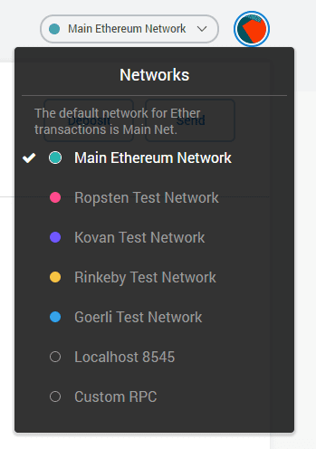

- Network Name

RSK Testnet

- New RPC URL

https://public-node.testnet.rsk.co

- ChainID (optional)

31

- Symbol (optional)

tR-BTC

- Block Explorer URL (optional)

https://explorer.testnet.rsk.co

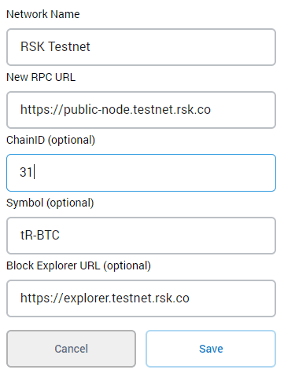

Después de configurarlo, cierre la ventana de configuración y selecciona RSK Tesnet.

# TestNet Faucet

Puedes solicitar Testnet R-BTC en

[faucet.testnet.rsk.co](https://faucet.testnet.rsk.co/)

# Remix

Ve a 

[http://remix.ethereum.org/](http://remix.ethereum.org/)

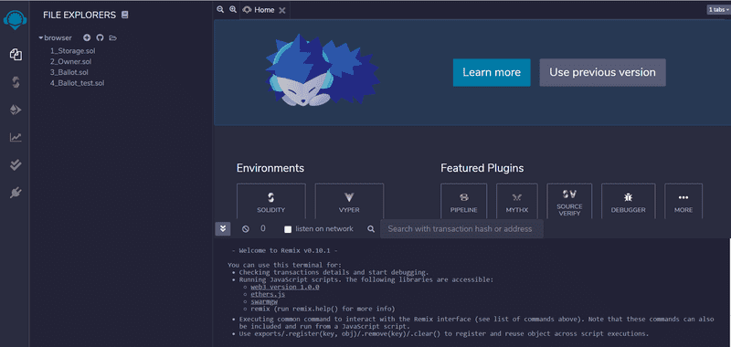

# Compilador Solidity

En el tercer botón en el lado izquierdo, haz clic en Solidity compiler

Es útil habilitar la compilación automática (auto-compile),  para compilar contratos inteligentes automáticamente al editar en Remix.

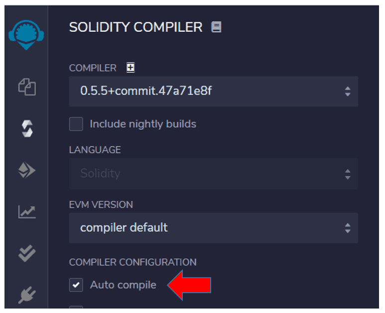

# Conexión de Remix con RSK testnet

Con la red RSK testnet seleccionada en Metamask ...

En Remix, en el lado izquierdo, ubica el botón Deploy and run transactions (Implementar y ejecutar transacciones).

Por ahora es el cuarto botón

En Environment, elige 

Injected Web3

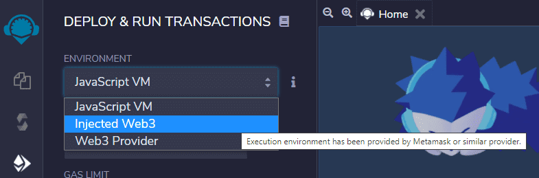

Injected Web3 conecta Remix con una cuenta activa en Metamask

Se abrirá una ventana popup de Metamask para autorizar la conexión.

Primero seleccione la cuenta y haz clic en botón Next. Probablemente solo tengas una.

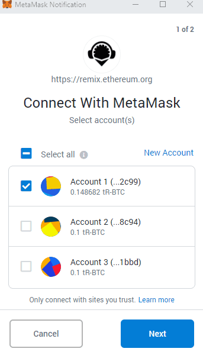

Después haz clic en botón Connect.

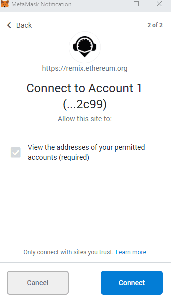

En Remix, en Deploy and run transactions, mira el Custom Network

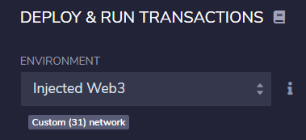

ChainID 31 se definió en la red personalizada RSK Testnet en Metamask.

# Creando el token

Haz clic en el segundo botón en el lado izquierdo - file explorer 

Haz clic en + para crear un archivo nuevo

File name: TokenLaBitconf.sol

Usa este ejemplo:

```solidity
// SPDX-License-Identifier: MIT
pragma solidity 0.6.12;

import "https://github.com/OpenZeppelin/openzeppelin-contracts/blob/master/contracts/token/ERC20/ERC20.sol";

contract TokenLaBitconf is ERC20 {
    constructor(uint256 initialSupply) public ERC20("Token La Bitconf 2020", "TLB") {
        _mint(msg.sender, initialSupply);
    }
}
```

# Compila el token

Si habilitó la compilación automática (auto-compile), el contrato inteligente ya está compilado y aparecerá una luz verde junto al tercer botón de la izquierda: Solidity compiler.

Si no lo ha habilitado:

* Haz clic en el tercer botón de la izquierda: Solidity compiler

* Haz clic en el botón Compilar TokenLaBitconf.sol

* Verifica el letrero verde en el tercer botón con el mensaje: compilation successful


# Deploy del token

En el panel lateral izquierdo, ve al botón Deploy and run transactions.

Por ahora es el cuarto botón.

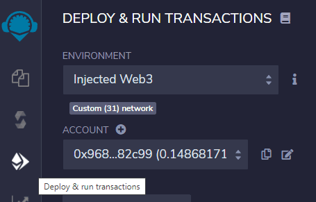

En este momento solo tenemos un contrato inteligente, por lo que se selecciona automáticamente en el dropbox

Vamos a crear 1000 tokens, com 18 casas decimales: 
1000000000000000000000

Este sítio es muy bueno para hacer las conversiones: [eth-converter.com/](https://eth-converter.com/)

Haz clic en el botón Deploy

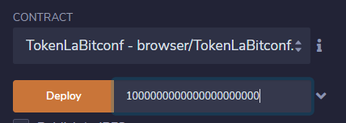

Se abrirá una ventana popup de Metamask para confirmar la transacción para crear el contrato inteligente

Haz clic en confirm

En la parte inferior derecha, podemos ver el mensaje.

creation of TokenLaBitconf pending...

Copia el address del token

0x69E79Cd83cf19501222358b16C818Ffe6FF31f5a

# RSKSwap - UniswapV2Router02

Ahora vamos a interactuar con el contrato inteligente principal de RSKSwap, que es `UniswapV2Router02`

RSK - UniswapV2Router02 testnet / mainnet

``` shell
0xf55c496bb1058690DB1401c4b9C19F3f44374961
```

## Interfaz UniswapV2Router02

Necesitamos tener la interfaz de las funciones de UniswapV2Router02 que usaremos aquí.

En file explorer, crea un archivo nuevo

File name: InterfaceRouter.sol

Usa este ejemplo:

```solidity
// SPDX-License-Identifier: MIT
pragma solidity 0.6.12;

// Source: https://github.com/Think-and-Dev/rskswap-periphery/blob/master/contracts/UniswapV2Router02.sol;

abstract contract InterfaceRouter {
    
    function addLiquidityETH(
        address token,
        uint amountTokenDesired,
        uint amountTokenMin,
        uint amountETHMin,
        address to,
        uint deadline
    ) external payable virtual returns (uint amountToken, uint amountETH, uint liquidity);

    address public WETH;
        
    //Si quiero comprar tokens X, ¿cuándo tengo que enviar tokens Y?
    function getAmountsIn(uint amountOut, address[] calldata path) 
        external view virtual returns (uint[] memory amounts);

    function swapETHForExactTokens(uint amountOut, address[] calldata path, address to, uint deadline)
        external
        payable
        virtual
        returns (uint[] memory amounts);
}
```

En el lado derecho del botón `At Address`, pegue la dirección de UniswapV2Router02,  `0xf55c496bb1058690DB1401c4b9C19F3f44374961` y haga clic en el botón `At Address`.

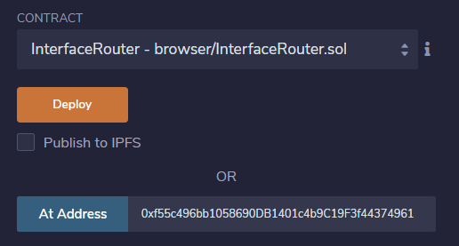

# RSKSwap App

A través de la interfaz de usuario de RSKSwap en [app.rskswap](https://app.rskswap.com), podemos hacer simulaciones y seguir lo que está sucediendo.
Conecte MetaMask y luego vaya a "Pool" e ingrese su dirección de token.

# Add Liquidity on RSKSwap

Vamos a crear un `pool de liquidez` para intercambiar nuestro token con tRBTC.

Por ejemplo:
- 0.1 RBTC = 100 tokens
- 0.001 RBTC por token
- 1000 token por RBTC

Se necesitan dos pasos para agregar liquidez:

1. Aprobar el Token `ERC20::approve(address _spender, uint256 _amount)`
2. Suministre la Liquidez a través de `UniswapV2Router02::addLiquidityETH(...)`


## Approve Router to Spent Token

En el token, vamos a aprobar RSKSwap para usar 100 tokens.
- address _spender: 0xf55c496bb1058690DB1401c4b9C19F3f44374961
- uint256 _amount: 100000000000000000000

``` shell
"0xf55c496bb1058690DB1401c4b9C19F3f44374961","100000000000000000000"
```

Haz clic en el botón `Approve`

## Add Liquidity usando Remix

En la interfaz `InterfaceRouter`, expandir el botón `addLiquidityETH`

Vamos a completar los parámetros:

- token = la dirección del token 
- amountTokenDesired = la cantidad de tokens que queremos agregar al fondo de liquidez
- amountTokenMin = amountTokenDesired porque es la primera vez que agregamos liquidez
- amountEthMin = mientras estamos creando este fondo de liquidez ahora, definiendo la cantidad de RBTCs (Ethers), estamos definiendo la cotización del token en RBTC (ETH)
- to = su dirección, porque usted es quien recibe las tarifas más tarde
- deadline = es una marca de tiempo (timestamp) de Unix en el futuro, es decir, vea el timestamp actual y agregue unos minutos.  

En el sitio [unixtimestamp](https://www.unixtimestamp.com/index.php) puedes consultar el timestamp actual.

Para agregar 5 minutos, use + 300 seconds

Por ejemplo:
- token = 0x69E79Cd83cf19501222358b16C818Ffe6FF31f5a
- amountTokenDesired = 100 * 10 ^18 (100 y 18 zeros) = 100000000000000000000
- amountTokenMin = amountTokenDesired because it's the first time we add liquidity
- amountEthMin = 0.001 * 10 ^18 = 1000000000000000
- to = 0xa52515946DAABe072f446Cc014a4eaA93fb9Fd79
- deadline = 1607692842


``` shell
"0x69E79Cd83cf19501222358b16C818Ffe6FF31f5a","100000000000000000000","100000000000000000000","1000000000000000","0xa52515946DAABe072f446Cc014a4eaA93fb9Fd79","1607692842"
```

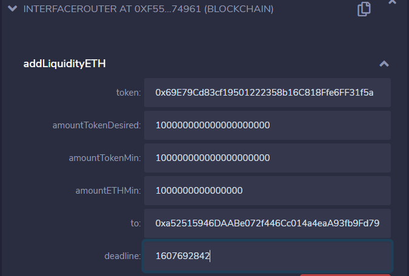

**ANTES DE** presionar `Transact`, complete la cantidad de ETHS a enviar, en la parte superior del formulario. Enviaremos 0.001 RBTC (Ether)

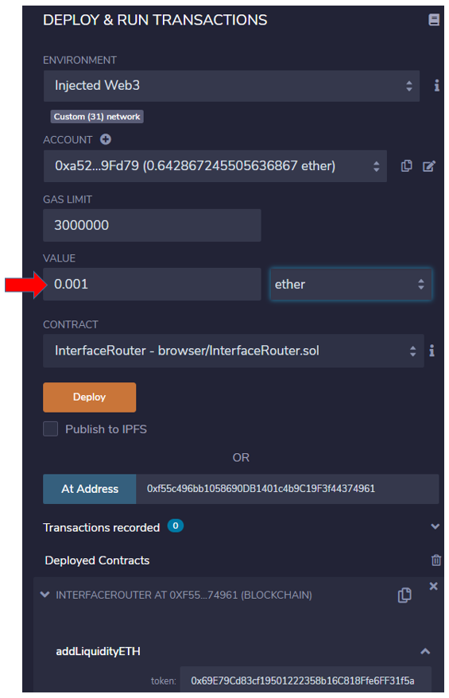

Haz clic en el botón `Transact` o `addLiquidityETH`

# Get Prices

Obtener cotizaciones y precios en RSKSwap mediante programación

Si quiero comprar tokens, ¿cuántos WETH (wRBTC) necesito enviar?

Para saber esto usaré la función `getAmountsIn`, con los parametros:

- amountOut = La cantidad que quieres recibir
- path = La ruta es una matriz de direcciones entre intercambios, en este caso: [wethAddress, tokenAddress]

Esto calculará la cantidad que debe proporcionar, por lo que proporcionará algunos RBTCs / ETHs (o wRBTC / WETH, que se convierten automáticamente), dado que desea que salgan x Tokens.

la dirección del token WETH ERC20 cambia de una red a otra, pero se guarda en una variable pública en el contrato `UniswapV2Router02` y podemos consultarla en la interfaz.

WETH ERC20:

```shell
0x09B6Ca5E4496238a1F176aEA6bB607db96C2286E
```

Digamos que queremos tener 1 token (1 * 10 ^ 18). ¿Cual es el precio?

Por ejemplo:

- amountOut = Recibe 1 token = 1 * 10 ^ 18 = 1000000000000000000
- path = ["0x09B6Ca5E4496238a1F176aEA6bB607db96C2286E", "0x69E79Cd83cf19501222358b16C818Ffe6FF31f5a"]

Llama `getAmountsIn`

```shell
"1000000000000000000",["0x09B6Ca5E4496238a1F176aEA6bB607db96C2286E","0x69E79Cd83cf19501222358b16C818Ffe6FF31f5a"]
```

En nuestro ejemplo, el resultado es

`amounts 1013140431395196,1000000000000000000`

Ou seja:
- 1013140431395196 wei RBTC (ETH) = 1000000000000000000 wei Token
- 0.001013140431395196 RBTC (ETH) = 1 Token

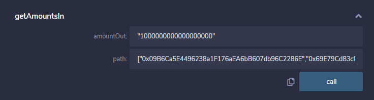

Quiero comprar 1 Token, tengo que enviar 0.001013140431395196 RBTC (ETH)

¿Por qué no es exactamente 0.001 RBTC (ETH)?

- Hay una pequeña tarifa del 0,30%
- La ejecución de este trade influirá en las reservas y, por lo tanto, es necesario ajustar la fórmula del producto constante, donde el producto k debe permanecer constante. Esto le dará un precio diferente al precio dado las reservas sin cambios.

# Haciendo el Swap 

El último paso es ejecutar un intercambio. Eso es bastante fácil ahora que comprenda cómo funciona el Router.

Cuando compra tokens con RBTC (ETH), que es probablemente uno de los escenarios más comunes, va a llamar a la función `swapETHForExactTokens`, con los parametros:

- amountOut = la cantidad de Token tiene decimales adjuntos, por lo que 1 token es 1 * 10 ^ 18
- path = es la matriz ["addressWei","addressToken"]
- to = es tu dirección
- deadline = el timestamp de Unix en el futuro, es decir, vea el timestamp actual y agregue unos minutos.

Por ejemplo, quiero comprar 1 Token:

- 0.001013140431395196 RBTC (ETH) = 1 Token

- amountOut = 1000000000000000000
- path = ["0x09B6Ca5E4496238a1F176aEA6bB607db96C2286E","0x69E79Cd83cf19501222358b16C818Ffe6FF31f5a"]
- to = 0xa52515946DAABe072f446Cc014a4eaA93fb9Fd79
- deadline = 1607694938

```shell
"1000000000000000000",["0x09B6Ca5E4496238a1F176aEA6bB607db96C2286E","0x69E79Cd83cf19501222358b16C818Ffe6FF31f5a"],"0xa52515946DAABe072f446Cc014a4eaA93fb9Fd79","1607694938"
```

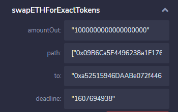

**ANTES DE** presionar `Transact`, complete la cantidad de RBTCs (ETHs) a enviar, en la parte superior del formulario. Enviaremos 10131404313951961 WEI

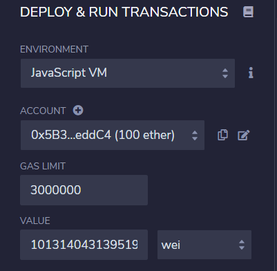

Haz clic en el botón `Transact` o `swapETHForExactTokens`


# Consideraciones finales

Te mostré cómo crear tu propio token e intercambialo en RSKSwap programáticamente, usando smart contracts.

Espero que este tutorial haya sido útil y agradezco tus comentarios. Compártelo si te gusta :)


