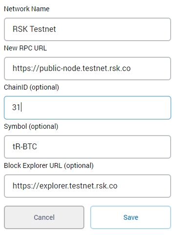
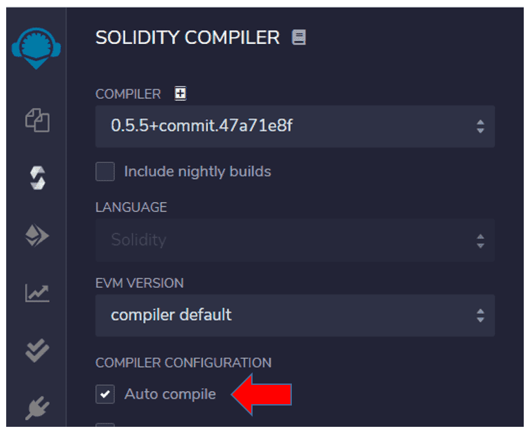
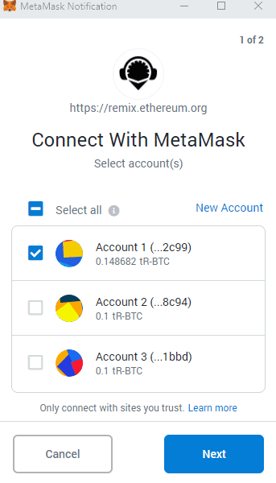
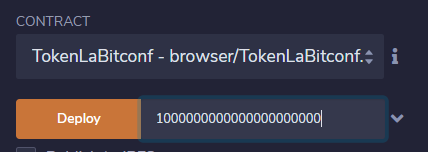
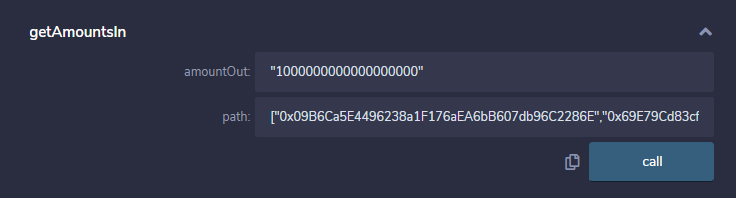

# Como usar RSKSwap com smart contracts

[RSKSwap](https://rskswap.com/) é uma exchange descentralizada, que permite negociar tokens ERC20 automaticamente, sem a necessidade de esperar um comprador ou um vendedor. 
Conta com as vantagens dos baixos custos e da segurança da rede RSK. 
Além disso, não precisa de KYC e não tem limites para saques ou depósitos.

Neste tutorial apresento um guia passo-a-passo para criar seu próprio token e trocá-lo em RSKSwap programaticamente, usando smart contracts.

Para saber mais, pode ler a [Documentação](https://rskswap.com/docs/v2) de RSKSwap.

# Overview

Executaremos estas etapas:

1. Conexão da carteira Metamask com RSK testnet;
2. Solicitar testnet R-BTCs no faucet;
3. Conexão do Remix com RSK testnet; 
4. Criar um token;
5. RSKSwap - UniswapV2Router02
6. Adicionar liquidez em RSKSwap
7. Obtener cotações
8. Fazer o Swap


# Requisitos

- Metamask - extensão do Google chrome 
- Remix - ferramenta web, online

Para aprender o báisco sobre Remix y Metamask, veja o tutorial 
[Primeiro smart contract com Remix e Metamask](pt/remix-metamask/readme.md)


## Metamask

Vá em [metamask.io](https://metamask.io/) e faça a instalação.

## Remix

Pode ser acessado em 
[remix.ethereum.org](https://remix.ethereum.org/)

# Conexão do Metamask com RSK testnet

No Metamask
- Vá em networks / redes
- Custom RPC


- Network Name

RSK Testnet

- New RPC URL

https://public-node.testnet.rsk.co

- ChainID (optional)

31

- Symbol (optional)

tR-BTC

- Block Explorer URL (optional)

https://explorer.testnet.rsk.co



Depois de configurar, feche a janela de configuração e selecione RSK Tesnet.

# TestNet Faucet

Você pode receber alguns Testnet R-BTC em 
[faucet.testnet.rsk.co](https://faucet.testnet.rsk.co/).

Use seu endereço da conta do Metamask

# Remix

Vá em 

[http://remix.ethereum.org/](http://remix.ethereum.org/)


# Solidity compiler

Clique no 3o botão do lado esquerdo - Solidity compiler

Habilite o auto-compile para facilitar sua vida compilando os contratos inteligentes automaticamente ao editar no Remix.



# Conexão do Remix com RSK testnet

Com a RSK network selecionada no Metamask...

No Remix, do lado esquerdo, procure o botão `Deploy and run transactions`.
Atualmente é o 4o botão

Em Environment, escolha `Injected Web3`


Injected Web3 conecta Remix com a conta ativa / selecionada no Metamask

Se abrirá una janela popup do Metamask para autorizar a conexão.

Primero selecione a conta e clique no botão Next. Provavelmente você terá apenas uma conta.



Em seguida clique no botão Connect.


No Remix, em Deploy and run transactions, veja o Custom Network


ChainID 31 foi definida na configuração da RSK Testnet no Metamask.

# Criando o token

Clique no 2o botão do lado esquerdo - file explorer

Clique no símbolo + para criar um novo arquivo

File name: TokenLaBitconf.sol

Usa este exemplo:

```solidity
// SPDX-License-Identifier: MIT
pragma solidity 0.6.12;

import "https://github.com/OpenZeppelin/openzeppelin-contracts/blob/master/contracts/token/ERC20/ERC20.sol";

contract TokenLaBitconf is ERC20 {
    constructor(uint256 initialSupply) public ERC20("Token La Bitconf 2020", "TLB") {
        _mint(msg.sender, initialSupply);
    }
}
```

# Compila o token

Se habilitou a compilação automática (auto-compile), o contrato inteligente já está compilado e aparecerá una luz verde junto ao terceiro botão na esquerda: Solidity compiler.

Se não habilitou:

* Clique no terceiro botão na esquerda: Solidity compiler

* Clique o botão Compilar TokenLaBitconf.sol

* Veja o sinal verde no terceiro botão com a mensagem: compilation successful


# Deploy do token

No painel lateral esquerdo, clique no botão Deploy and run transactions.


Neste momento temos apenas um contrato inteligente, então ele é selecionado automaticamente no dropbox

Vamos criar 1000 tokens, com 18 casas decimais: 
1000000000000000000000

Este site é mujito bom para fazer conversões: [eth-converter.com/](https://eth-converter.com/)

Clique no botão Deploy



Se abrirá uma janela popup de Metamask para confirmar a transação para criar o contrato inteligente

Clique em confirm

Na parte de baixo, à direita, podemos ver a mensagem:

creation of TokenLaBitconf pending...

Quando a transação confirmar, copia o endereço do token

0x69E79Cd83cf19501222358b16C818Ffe6FF31f5a

# RSKSwap - UniswapV2Router02

Agora vamos interagir com o contrato inteligente principal de RSKSwap, que é `UniswapV2Router02`

RSK - UniswapV2Router02 testnet / mainnet

``` shell
0xf55c496bb1058690DB1401c4b9C19F3f44374961
```

## Interface UniswapV2Router02

Necessitamos de uma interface com as funções de UniswapV2Router02 que usaremos aquí.

No file explorer, cria um novo arquivo

File name: InterfaceRouter.sol

Use este exemplo:

```solidity
// SPDX-License-Identifier: MIT
pragma solidity 0.6.12;

// Source: https://github.com/Think-and-Dev/rskswap-periphery/blob/master/contracts/UniswapV2Router02.sol;

abstract contract InterfaceRouter {
    
    function addLiquidityETH(
        address token,
        uint amountTokenDesired,
        uint amountTokenMin,
        uint amountETHMin,
        address to,
        uint deadline
    ) external payable virtual returns (uint amountToken, uint amountETH, uint liquidity);

    address public WETH;
        
    //Si quiero comprar tokens X, ¿cuándo tengo que enviar tokens Y?
    function getAmountsIn(uint amountOut, address[] calldata path) 
        external view virtual returns (uint[] memory amounts);

    function swapETHForExactTokens(uint amountOut, address[] calldata path, address to, uint deadline)
        external
        payable
        virtual
        returns (uint[] memory amounts);
}
```

No lado direito do botão `At Address`, cole o endereço da UniswapV2Router02,  `0xf55c496bb1058690DB1401c4b9C19F3f44374961` e clique no botão `At Address`.


# RSKSwap App

Através da appp do RSKSwap, em [app.rskswap](https://app.rskswap.com), podemos fazer simulações e acompanhar o que está acontecendo.
Conecte MetaMask e depois vá em "Pool" e preencha o endereço do seu token.

# Add Liquidity on RSKSwap

Vamos criar um `pool de liquidez` para trocar nosso token com tRBTC.

Por exemplo:
- 0.1 RBTC = 100 tokens
- 0.001 RBTC por token
- 1000 token por RBTC

Precisamos fazer estas etapas para adicionar liquidez:

1. Aprovar o Token `ERC20::approve(address _spender, uint256 _amount)`
2. Acrescentar ao pool de liquidez usando `UniswapV2Router02::addLiquidityETH(...)`


## Approve Router to Spent Token

No token, vamos aprovar RSKSwap para usar 100 tokens.
- address _spender: 0xf55c496bb1058690DB1401c4b9C19F3f44374961
- uint256 _amount: 100000000000000000000

``` shell
"0xf55c496bb1058690DB1401c4b9C19F3f44374961","100000000000000000000"
```

Clique no botão `Approve`

## Add Liquidity usando Remix

na interface `InterfaceRouter`, expanda o botão `addLiquidityETH`

Vamos preencher os parâmetros:

- token = o endereço do seu token 
- amountTokenDesired = a quantidade de tokens que desejamos somar ao fundo de liquidez
- amountTokenMin = amountTokenDesired porque é a primeira vez que agregamos liquidez
- amountEthMin = como estamos criando este fundo de liquidez agora, quando definimos a quantidade de RBTCs (Ethers), estamos definindo a cotação do token em RBTC (ETH)
- to = o endereço da sua wallet, porque é você quem vai receber as tarifas depois
- deadline = é um timestamp do Unix no futuro, ou seja, veja o timestamp atual y adicione alguns segundos ou minutos.  

No site [unixtimestamp](https://www.unixtimestamp.com/index.php) pode consultar o timestamp atual.

Para adicionar 5 minutos, use + 300 seconds

Por exemplo:
- token = 0x69E79Cd83cf19501222358b16C818Ffe6FF31f5a
- amountTokenDesired = 100 * 10 ^18 (100 y 18 zeros) = 100000000000000000000
- amountTokenMin = amountTokenDesired because it's the first time we add liquidity
- amountEthMin = 0.001 * 10 ^18 = 1000000000000000
- to = 0xa52515946DAABe072f446Cc014a4eaA93fb9Fd79
- deadline = 1607692842


``` shell
"0x69E79Cd83cf19501222358b16C818Ffe6FF31f5a","100000000000000000000","100000000000000000000","1000000000000000","0xa52515946DAABe072f446Cc014a4eaA93fb9Fd79","1607692842"
```


**ANTES DE** pressionar `Transact`, complete a quantidade de ETHS a enviar, na parte superior do formulário. Enviaremos 0.001 RBTC (Ether)


Clique no botão `Transact` ou `addLiquidityETH`

# Get Prices

Vamos obter cotações e preços em RSKSwap mediante programação

Se eu quero comprar tokens, ¿quantos WETH (wRBTC) necessito enviar?

Para saber isto usarei a função `getAmountsIn`, com os parâmetros:

- amountOut = A quantidade que quero reciber
- path = A rota é um array de endereços do swap, neste caso: [wethAddress, tokenAddress]

Isto calculará a quantidade que deve pagar, enviando alguns RBTCs / ETHs (ou wRBTC / WETH, que se convertem automaticamente), dado que deseja que sejam enviados x Tokens.

O endereço do token WETH ERC20 pode alterar de una rede a outra, então ele é guardado em uma variável pública no contrato `UniswapV2Router02` e podemos consultá-lo na interface.

WETH ERC20:

```shell
0x09B6Ca5E4496238a1F176aEA6bB607db96C2286E
```

Digamos que desejamos obter 1 token (1 * 10 ^ 18). ¿Qual é o preço?

Por exemplo:

- amountOut = Recebe 1 token = 1 * 10 ^ 18 = 1000000000000000000
- path = ["0x09B6Ca5E4496238a1F176aEA6bB607db96C2286E", "0x69E79Cd83cf19501222358b16C818Ffe6FF31f5a"]

Chama a função `getAmountsIn`

```shell
"1000000000000000000",["0x09B6Ca5E4496238a1F176aEA6bB607db96C2286E","0x69E79Cd83cf19501222358b16C818Ffe6FF31f5a"]
```

Em nosso exemplo, o resultado é

`amounts 1013140431395196,1000000000000000000`

Ou seja:
- 1013140431395196 wei RBTC (ETH) = 1000000000000000000 wei Token
- 0.001013140431395196 RBTC (ETH) = 1 Token



Quero comprar 1 Token, então tenho que enviar 0.001013140431395196 RBTC (ETH)

Por que não é exatamente 0.001 RBTC (ETH)?

- Existe uma pequena tarifa de 0,30%
- A execução deste trade influenciará as reservas e, por causa disto, é necessário ajustar a fórmula da constante, onde o produto k deve permanecer constante. Isto dará un preço diferente do preço dado las reservas sem cambios.

# Fazendo o Swap 

O último passo é executar um swap. Isto é fácil agora que já compreendeu como funciona o Router.

Quando compra tokens com RBTC (ETH), que é provavelmente um dos cenarios mas comuns, vá chamar a função `swapETHForExactTokens`, com os parametros:

- amountOut = a quantidade de Token com seus decimais anexados, então 1 token é 1 * 10 ^ 18
- path = é o array ["addressWei","addressToken"]
- to = é o endereço da sua carteira
- deadline = o timestamp de Unix no futuro, ou seja, veja o timestamp atual e adicione alguns minutos.

Por exemplo, quero comprar 1 Token:

- 0.001013140431395196 RBTC (ETH) = 1 Token

- amountOut = 1000000000000000000
- path = ["0x09B6Ca5E4496238a1F176aEA6bB607db96C2286E","0x69E79Cd83cf19501222358b16C818Ffe6FF31f5a"]
- to = 0xa52515946DAABe072f446Cc014a4eaA93fb9Fd79
- deadline = 1607694938

```shell
"1000000000000000000",["0x09B6Ca5E4496238a1F176aEA6bB607db96C2286E","0x69E79Cd83cf19501222358b16C818Ffe6FF31f5a"],"0xa52515946DAABe072f446Cc014a4eaA93fb9Fd79","1607694938"
```


**ANTES DE** pressionar `Transact`, preencha a quantidade de RBTCs (ETHs) a enviar, na parte superior do formulario. Enviaremos 10131404313951961 WEI


Clique no botão `Transact` ou `swapETHForExactTokens`


# Considerações finais

Mostrei como criar seu proprio token e trocá-lo em RSKSwap programaticamente, usando smart contracts.

Espero que este tutorial seja útil y agradeço seus comentarios. 
Compartilhe se você gostou :)
